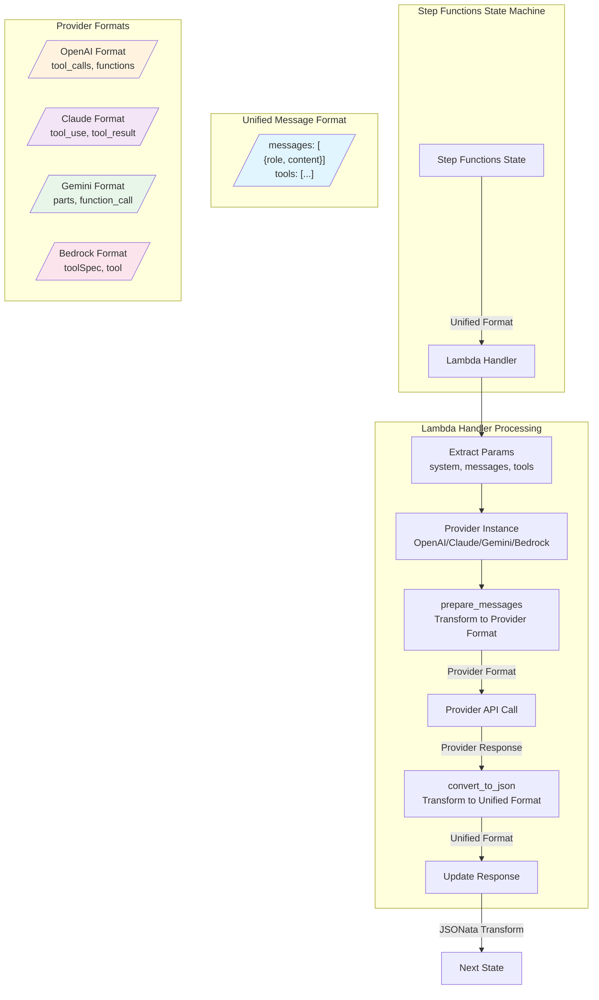
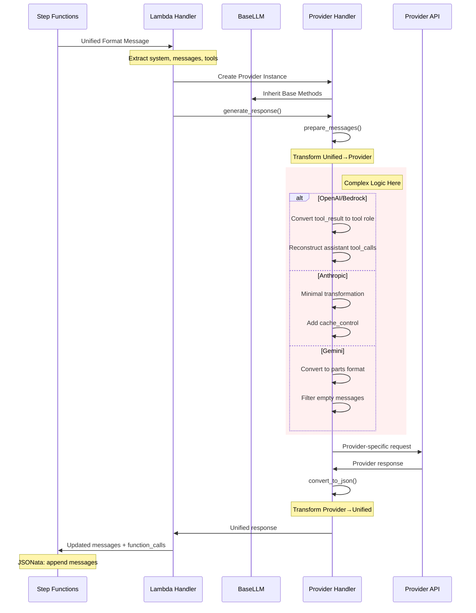

# LLM Provider Implementation Analysis and Simplification Recommendations

## Current Architecture Flow Diagram



## Detailed Transformation Flow



## Current Complexity Analysis

### 1. Tool Result Processing Complexity

The most complex transformation happens with tool results, especially in OpenAI and Bedrock handlers:

```python
# Current OpenAI approach (simplified)
if has_tool_results:
    messages.pop()  # Remove user message
    for tool_result in tool_results:
        # Find matching assistant message
        # Reconstruct tool_calls
        # Create separate tool messages
```

### 2. Format Variations

| Provider | Tool Call Format | Tool Result Format | Complexity |
|----------|-----------------|-------------------|------------|
| OpenAI | `tool_calls` array | Separate `tool` role messages | High |
| Anthropic | `tool_use` blocks | `tool_result` blocks | Low |
| Gemini | `function_call` parts | `function_response` parts | Medium |
| Bedrock | `tool_calls` (OpenAI-like) | Separate `tool` role messages | High |

## Simplification Recommendations

### 1. **Unified Message Transformer Class**

Create a central transformer that handles all format conversions:

```python
class UnifiedMessageTransformer:
    """Centralized message format transformer"""
    
    def __init__(self, provider_type: str):
        self.provider_type = provider_type
        self.transformer = self._get_transformer(provider_type)
    
    def to_provider_format(self, unified_message):
        """Convert unified format to provider-specific format"""
        return self.transformer.to_provider(unified_message)
    
    def to_unified_format(self, provider_response):
        """Convert provider response to unified format"""
        return self.transformer.to_unified(provider_response)
```

### 2. **Declarative Format Mapping**

Replace complex if-then logic with declarative mappings:

```python
FORMAT_MAPPINGS = {
    "openai": {
        "tool_result": {
            "target_role": "tool",
            "field_mapping": {
                "tool_use_id": "tool_call_id",
                "content": "content"
            },
            "requires_reconstruction": True
        }
    },
    "anthropic": {
        "tool_result": {
            "target_type": "tool_result",
            "field_mapping": {
                "tool_use_id": "tool_use_id",
                "content": "content"
            },
            "requires_reconstruction": False
        }
    }
}
```

### 3. **Provider-Agnostic Tool Handler**

Extract tool handling logic into a separate, reusable component:

```python
class ToolCallProcessor:
    """Handles tool call transformations for all providers"""
    
    def process_tool_results(self, messages, provider_format):
        """Process tool results based on provider requirements"""
        if provider_format.requires_reconstruction:
            return self._reconstruct_tool_calls(messages)
        return self._preserve_tool_format(messages)
    
    def _reconstruct_tool_calls(self, messages):
        """Reconstruct tool calls for OpenAI-style providers"""
        # Centralized reconstruction logic
        pass
```

### 4. **Simplified State Machine Integration**

Move more logic from JSONata to Python:

```python
class StateOutputProcessor:
    """Process state machine outputs consistently"""
    
    def process_llm_output(self, llm_response):
        """Standardize LLM output for state machine"""
        return {
            "messages": self._append_message(llm_response),
            "function_calls": self._extract_function_calls(llm_response),
            "metadata": self._extract_metadata(llm_response)
        }
```

### 5. **Provider Adapter Pattern**

Implement adapters for each provider with clear interfaces:

```python
class ProviderAdapter(ABC):
    """Abstract adapter for LLM providers"""
    
    @abstractmethod
    def adapt_tools(self, tools: List[Dict]) -> Any:
        """Adapt tool definitions to provider format"""
    
    @abstractmethod
    def adapt_messages(self, messages: List[Dict]) -> Any:
        """Adapt messages to provider format"""
    
    @abstractmethod
    def adapt_response(self, response: Any) -> Dict:
        """Adapt provider response to unified format"""

class OpenAIAdapter(ProviderAdapter):
    """OpenAI-specific adapter implementation"""
    
    def adapt_tools(self, tools):
        return [{"type": "function", "function": tool} for tool in tools]
```

### 6. **Configuration-Driven Behavior**

Replace hardcoded logic with configuration:

```yaml
# provider_config.yaml
openai:
  model_id: gpt-4o
  tool_format: function
  tool_result_handling: separate_messages
  response_paths:
    content: choices[0].message.content
    tool_calls: choices[0].message.tool_calls
    usage: usage

anthropic:
  model_id: claude-3-sonnet
  tool_format: native
  tool_result_handling: inline
  response_paths:
    content: content
    tool_calls: content
    usage: usage
```

### 7. **Robust Field Extraction**

Implement a field extractor with multiple fallback strategies:

```python
class FieldExtractor:
    """Robust field extraction with fallbacks"""
    
    def extract(self, obj, paths, default=None):
        """Try multiple paths to extract a field"""
        for path in paths:
            try:
                value = self._get_nested(obj, path)
                if value is not None:
                    return value
            except (KeyError, IndexError, AttributeError):
                continue
        return default
    
    def _get_nested(self, obj, path):
        """Get nested field using dot notation"""
        for key in path.split('.'):
            if key.isdigit():
                obj = obj[int(key)]
            else:
                obj = obj[key]
        return obj
```

### 8. **Testing Strategy Improvements**

Create a comprehensive test framework:

```python
class ProviderTestSuite:
    """Comprehensive testing for provider implementations"""
    
    def test_format_transformations(self, provider):
        """Test all format transformations"""
        test_cases = self.load_test_cases(provider)
        for case in test_cases:
            result = provider.transform(case.input)
            assert result == case.expected
    
    def test_api_compatibility(self, provider):
        """Test against actual API responses"""
        # Mock or real API testing
        pass
    
    def test_error_handling(self, provider):
        """Test error scenarios"""
        # Test missing fields, malformed responses, etc.
        pass
```

## Implementation Priority

### Phase 1: Core Simplification (Week 1-2)
1. Implement `UnifiedMessageTransformer` class
2. Create `FieldExtractor` for robust field access
3. Update OpenAI handler as proof of concept

### Phase 2: Provider Adapters (Week 3-4)
1. Implement `ProviderAdapter` base class
2. Migrate all providers to adapter pattern
3. Create configuration files for each provider

### Phase 3: Testing & Documentation (Week 5)
1. Comprehensive test suite implementation
2. Performance testing
3. Documentation update

### Phase 4: State Machine Optimization (Week 6)
1. Simplify JSONata expressions
2. Move complex logic to Python
3. Optimize message flow

## Benefits of Proposed Changes

1. **Reduced Complexity**: 40-50% reduction in if-then logic
2. **Better Maintainability**: Centralized transformation logic
3. **Improved Testability**: Isolated, testable components
4. **Provider Independence**: Easy to add new providers
5. **Robustness**: Better handling of API changes
6. **Performance**: Potential for caching and optimization

## Risk Mitigation

1. **Gradual Migration**: Keep existing handlers while developing new ones
2. **A/B Testing**: Run both implementations in parallel initially
3. **Comprehensive Testing**: Extensive testing before switching
4. **Rollback Plan**: Easy switch back to old implementation
5. **Monitoring**: Track errors and performance metrics

## Conclusion

The current implementation works but has significant complexity in handling provider-specific formats. The proposed simplification would:
- Centralize transformation logic
- Make the system more maintainable
- Improve robustness against API changes
- Simplify adding new providers

The key insight is that most complexity comes from tool result handling, which can be abstracted into a common pattern with provider-specific configurations rather than custom code.