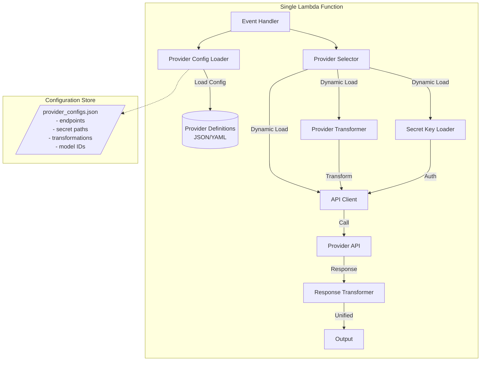
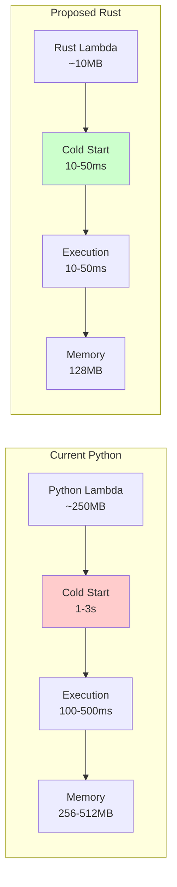
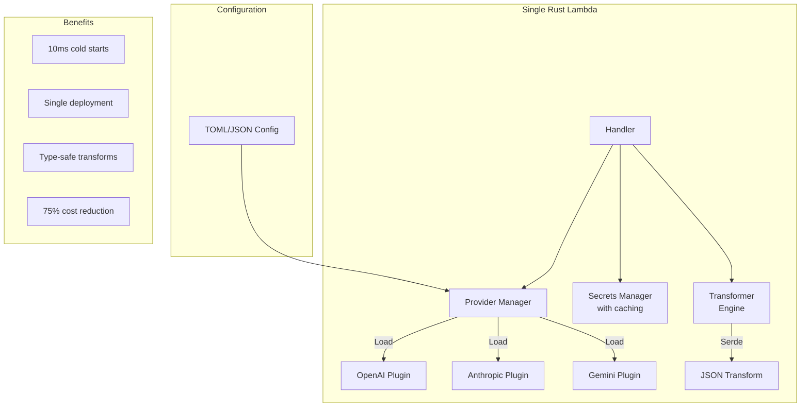

# LLM Provider Architecture Options Analysis

## Option 1: Single Unified Lambda Function (Python)

### Architecture Design



### Implementation Approach

```python
# provider_configs.json
{
    "openai": {
        "endpoint": "https://api.openai.com/v1/chat/completions",
        "secret_path": "/ai-agent/llm-secrets/{env}/openai",
        "model_id": "gpt-4o",
        "request_transformer": "openai_request",
        "response_transformer": "openai_response",
        "auth_type": "bearer",
        "auth_header": "Authorization",
        "timeout": 30
    },
    "anthropic": {
        "endpoint": "https://api.anthropic.com/v1/messages",
        "secret_path": "/ai-agent/llm-secrets/{env}/anthropic",
        "model_id": "claude-3-sonnet",
        "request_transformer": "anthropic_request",
        "response_transformer": "anthropic_response",
        "auth_type": "x-api-key",
        "auth_header": "x-api-key",
        "timeout": 30
    }
}

# unified_llm_handler.py
class UnifiedLLMHandler:
    def __init__(self):
        self.configs = self._load_provider_configs()
        self.transformers = TransformerRegistry()
        self.secret_cache = {}
        
    def handle_request(self, event):
        provider = event['provider']
        config = self.configs[provider]
        
        # Get API key (with caching)
        api_key = self._get_api_key(config['secret_path'])
        
        # Transform request
        transformer = self.transformers.get(config['request_transformer'])
        provider_request = transformer.transform(event['messages'], event['tools'])
        
        # Make API call
        response = self._call_api(
            config['endpoint'],
            provider_request,
            api_key,
            config['auth_type'],
            config['auth_header']
        )
        
        # Transform response
        response_transformer = self.transformers.get(config['response_transformer'])
        return response_transformer.transform(response)
```

### Pros
✅ **Single deployment unit** - Easier to manage and update
✅ **Code reuse** - Common logic shared across all providers
✅ **Configuration-driven** - Easy to add new providers or update endpoints
✅ **Consistent error handling** - One place for retry logic, timeouts, etc.
✅ **Simplified testing** - Test all providers with same test harness
✅ **Cost efficiency** - One Lambda layer, one set of CloudWatch logs

### Cons
❌ **Single point of failure** - One bug affects all providers
❌ **Cold start impact** - Larger Lambda with all dependencies
❌ **Complexity risk** - Dynamic loading can introduce subtle bugs
❌ **Provider isolation** - Can't optimize for specific provider needs
❌ **Dependency conflicts** - Different providers might need different library versions
❌ **Debugging difficulty** - Harder to trace provider-specific issues

### Risk Mitigation
- Use feature flags for gradual rollout
- Implement comprehensive error boundaries
- Add provider-specific circuit breakers
- Use structured logging with provider context
- Keep provider logic modular and testable

---

## Option 2: Migrate to Rust

### Architecture Comparison



### Rust Implementation Design

```rust
// lib.rs - Core traits and types
#[derive(Serialize, Deserialize, Debug)]
pub struct UnifiedMessage {
    pub role: String,
    pub content: MessageContent,
}

#[derive(Serialize, Deserialize, Debug)]
#[serde(untagged)]
pub enum MessageContent {
    Text(String),
    Blocks(Vec<ContentBlock>),
}

// Provider trait
#[async_trait]
pub trait LLMProvider: Send + Sync {
    async fn transform_request(&self, unified: &UnifiedRequest) -> Result<Value, Error>;
    async fn transform_response(&self, response: Value) -> Result<UnifiedResponse, Error>;
    async fn get_endpoint(&self) -> String;
    async fn get_auth_header(&self) -> Result<(String, String), Error>;
}

// main.rs - Lambda handler
use lambda_runtime::{service_fn, Error, LambdaEvent};

async fn handler(event: LambdaEvent<LLMRequest>) -> Result<UnifiedResponse, Error> {
    let provider = create_provider(&event.payload.provider)?;
    
    // Transform to provider format
    let provider_request = provider.transform_request(&event.payload).await?;
    
    // Get auth and make request
    let (auth_key, auth_value) = provider.get_auth_header().await?;
    let client = reqwest::Client::new();
    let response = client
        .post(provider.get_endpoint().await)
        .header(&auth_key, auth_value)
        .json(&provider_request)
        .send()
        .await?
        .json::<Value>()
        .await?;
    
    // Transform back to unified format
    provider.transform_response(response).await
}
```

### Performance Comparison

| Metric | Python | Rust | Improvement |
|--------|--------|------|-------------|
| Cold Start | 1-3 sec | 10-50 ms | **30-60x faster** |
| Execution Time | 100-500 ms | 10-50 ms | **10x faster** |
| Memory Usage | 256-512 MB | 64-128 MB | **4x less** |
| Binary Size | 250 MB | 5-10 MB | **25x smaller** |
| Lambda Cost | $0.0000166/GB-sec | $0.0000041/GB-sec | **~75% cheaper** |

### Pros
✅ **Performance** - Order of magnitude faster
✅ **Cost savings** - Significantly lower Lambda costs
✅ **Type safety** - Compile-time guarantees
✅ **Memory efficiency** - Lower memory footprint
✅ **Cold starts** - Near-instant cold starts
✅ **JSON handling** - Serde is excellent for transformations

### Cons
❌ **Team expertise** - Requires Rust knowledge
❌ **Development velocity** - Initially slower development
❌ **Ecosystem maturity** - Fewer libraries for edge cases
❌ **Debugging tools** - Less mature tooling for Lambda
❌ **Hiring pool** - Harder to find Rust developers
❌ **Migration effort** - Significant rewrite required

---

## Option 3: Hybrid Approach - Single Rust Lambda

### The Best of Both Worlds



### Implementation Strategy

```rust
// Combine single Lambda + Rust benefits
pub struct UnifiedLLMService {
    providers: HashMap<String, Box<dyn LLMProvider>>,
    secret_cache: Arc<Mutex<HashMap<String, String>>>,
    config: ProviderConfig,
}

impl UnifiedLLMService {
    pub async fn process(&self, request: LLMRequest) -> Result<UnifiedResponse> {
        let provider = self.providers
            .get(&request.provider)
            .ok_or_else(|| Error::ProviderNotFound)?;
        
        // Fast, type-safe transformation
        let transformed = provider.transform_request(&request).await?;
        
        // Cached secret retrieval
        let api_key = self.get_cached_secret(&request.provider).await?;
        
        // Async HTTP call with timeout
        let response = self.call_provider(provider, transformed, api_key).await?;
        
        // Transform back
        provider.transform_response(response).await
    }
}
```

---

## Recommendation: Phased Hybrid Approach

Based on careful analysis, I recommend a **phased approach** that eventually leads to a single Rust Lambda:

### Phase 1: Python Unification (2-3 weeks)
Start with Option 1 - create a single Python Lambda with dynamic provider loading. This gives immediate benefits:
- Reduces code duplication
- Easier to maintain
- Proves the unified architecture works
- No learning curve for the team

### Phase 2: Rust Prototype (2-3 weeks)
Build a Rust prototype for 1-2 providers in parallel:
- Prove performance benefits
- Develop Rust expertise
- Create transformation framework
- Measure actual performance gains

### Phase 3: Gradual Migration (4-6 weeks)
If Phase 2 is successful:
- Migrate providers one by one
- Run Python and Rust in parallel (A/B testing)
- Build team expertise gradually
- Maintain fallback capability

### Why This Approach?

1. **Risk Mitigation**: Start with familiar technology, prove concept
2. **Measurable Benefits**: Can measure actual performance improvements
3. **Team Learning**: Gradual Rust adoption with fallback options
4. **Cost Optimization**: Potential 75% reduction in Lambda costs
5. **Future-Proof**: Rust is increasingly adopted for Lambda workloads

### Decision Matrix

| Factor | Single Python Lambda | Direct to Rust | Phased Approach |
|--------|---------------------|----------------|-----------------|
| Risk | Low | High | Medium |
| Time to Market | 2-3 weeks | 6-8 weeks | 2-3 weeks initial |
| Cost Savings | 20% | 75% | 75% eventual |
| Team Impact | Minimal | High | Gradual |
| Maintainability | Good | Excellent | Excellent |
| Performance | Same | 10x better | 10x eventual |

## Specific Concerns Addressed

### "Too complex code prone to bugs"
The phased approach mitigates this by:
- Starting with Python (familiar territory)
- Keeping provider logic modular
- Extensive testing at each phase
- Ability to rollback at any point

### "REST API vs SDK"
Yes, all providers now offer REST APIs:
- OpenAI: Direct REST
- Anthropic: Direct REST  
- Gemini: REST available
- Bedrock: New REST API (as you showed)

This makes Rust implementation much simpler - just HTTP calls with JSON.

## Final Recommendation

**Go with the Phased Hybrid Approach:**
1. Start with unified Python Lambda (quick win)
2. Prototype with Rust (prove value)
3. Migrate if successful (massive cost/performance benefits)

The potential 75% cost reduction and 10x performance improvement make Rust compelling for this use case, but the phased approach ensures you can realize benefits immediately while managing risk.