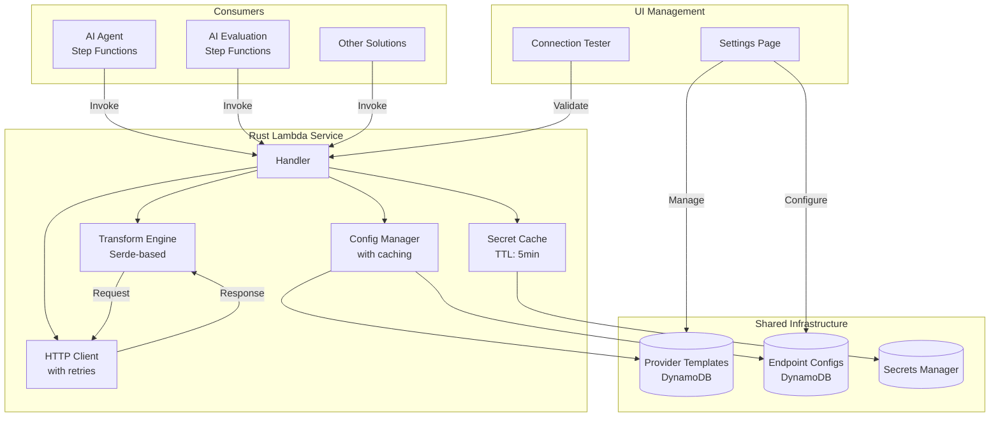

# Unified Rust LLM Service Architecture

## Executive Summary

Build a **single, high-performance Rust Lambda** that serves as a unified LLM calling service across all solutions (AI Agent, AI Evaluation Framework, etc.). This service will be configuration-driven, support dynamic provider management via DynamoDB, and can be developed in parallel with the existing system for risk-free deployment.

## Architecture Design



## Database Schema (Leveraging Existing Patterns)

### Provider Templates Table
```typescript
interface ProviderTemplate {
    provider_id: string;           // e.g., "openai", "anthropic"
    provider_name: string;          // e.g., "OpenAI GPT-4"
    base_url: string;              // e.g., "https://api.openai.com/v1"
    endpoint_path: string;         // e.g., "/chat/completions"
    auth_type: string;             // "bearer", "x-api-key", "aws-sig-v4"
    auth_header: string;           // "Authorization", "x-api-key"
    request_transformer: string;   // "openai_v1", "anthropic_v1"
    response_transformer: string;  // "openai_v1", "anthropic_v1"
    default_timeout: number;       // 30
    max_retries: number;          // 3
    supports_streaming: boolean;   // true/false
    supports_tools: boolean;       // true/false
    created_at: string;
    updated_at: string;
}
```

### Endpoint Configurations Table
```typescript
interface EndpointConfig {
    endpoint_id: string;           // UUID
    provider_id: string;           // Reference to template
    environment: string;           // "prod", "dev"
    name: string;                  // "Production GPT-4"
    model_id: string;              // "gpt-4", "claude-3-sonnet"
    secret_path: string;           // "/ai-agent/llm-secrets/prod/openai"
    custom_headers?: object;       // Additional headers
    rate_limit?: number;           // Requests per minute
    priority: number;              // For fallback ordering
    enabled: boolean;              // Active/inactive
    test_status?: string;          // "passed", "failed", "untested"
    last_tested?: string;          // ISO timestamp
    metadata?: object;             // Custom fields
}
```

### Agent-Model Assignments Table (Existing)
```typescript
interface AgentModelAssignment {
    agent_id: string;
    endpoint_id: string;
    fallback_endpoint_ids?: string[];
    created_by: string;
    created_at: string;
}
```

## Rust Implementation

### Core Service Structure

```rust
// src/main.rs
use lambda_runtime::{service_fn, Error, LambdaEvent};
use aws_sdk_dynamodb::Client as DynamoClient;
use aws_sdk_secretsmanager::Client as SecretsClient;
use serde::{Deserialize, Serialize};
use std::sync::Arc;
use tokio::sync::RwLock;

#[derive(Clone)]
struct LLMService {
    dynamo: Arc<DynamoClient>,
    secrets: Arc<SecretsClient>,
    http_client: Arc<reqwest::Client>,
    config_cache: Arc<RwLock<ConfigCache>>,
    secret_cache: Arc<RwLock<SecretCache>>,
}

#[derive(Deserialize)]
struct LLMRequest {
    endpoint_id: Option<String>,      // Direct endpoint selection
    provider: Option<String>,          // Or provider selection
    agent_id: Option<String>,          // Or agent-based selection
    messages: Vec<UnifiedMessage>,
    tools: Option<Vec<UnifiedTool>>,
    temperature: Option<f32>,
    max_tokens: Option<i32>,
    stream: Option<bool>,
}

#[derive(Serialize)]
struct LLMResponse {
    message: AssistantMessage,
    function_calls: Option<Vec<FunctionCall>>,
    metadata: ResponseMetadata,
    endpoint_used: String,
}

impl LLMService {
    async fn process_request(&self, request: LLMRequest) -> Result<LLMResponse, Error> {
        // 1. Resolve endpoint configuration
        let endpoint = self.resolve_endpoint(&request).await?;
        
        // 2. Get provider template
        let provider = self.get_provider_template(&endpoint.provider_id).await?;
        
        // 3. Get API key from secrets manager (with caching)
        let api_key = self.get_cached_secret(&endpoint.secret_path).await?;
        
        // 4. Transform request to provider format
        let transformer = self.get_transformer(&provider.request_transformer)?;
        let provider_request = transformer.transform_request(&request)?;
        
        // 5. Make HTTP request with retries
        let response = self.call_provider(
            &provider,
            &endpoint,
            provider_request,
            api_key
        ).await?;
        
        // 6. Transform response to unified format
        let response_transformer = self.get_transformer(&provider.response_transformer)?;
        let unified_response = response_transformer.transform_response(response)?;
        
        // 7. Return with metadata
        Ok(LLMResponse {
            message: unified_response.message,
            function_calls: unified_response.function_calls,
            metadata: ResponseMetadata {
                endpoint_id: endpoint.endpoint_id,
                model_id: endpoint.model_id,
                provider: provider.provider_name,
                latency_ms: unified_response.latency,
                tokens: unified_response.usage,
            },
            endpoint_used: endpoint.name,
        })
    }
}
```

### Transform Engine

```rust
// src/transformers/mod.rs
use serde_json::Value;

pub trait MessageTransformer: Send + Sync {
    fn transform_request(&self, request: &LLMRequest) -> Result<Value, Error>;
    fn transform_response(&self, response: Value) -> Result<UnifiedResponse, Error>;
}

// src/transformers/openai.rs
pub struct OpenAITransformer;

impl MessageTransformer for OpenAITransformer {
    fn transform_request(&self, request: &LLMRequest) -> Result<Value, Error> {
        // Fast, type-safe transformation using serde
        let mut messages = Vec::new();
        
        for msg in &request.messages {
            messages.push(self.transform_message(msg)?);
        }
        
        let mut body = json!({
            "messages": messages,
            "model": request.model_id,
        });
        
        if let Some(tools) = &request.tools {
            body["tools"] = self.transform_tools(tools)?;
        }
        
        Ok(body)
    }
    
    fn transform_response(&self, response: Value) -> Result<UnifiedResponse, Error> {
        // Robust extraction with fallbacks
        let message = self.extract_message(&response)?;
        let function_calls = self.extract_function_calls(&response)?;
        let usage = self.extract_usage(&response)?;
        
        Ok(UnifiedResponse {
            message,
            function_calls,
            usage,
            raw_response: response,
        })
    }
}
```

### Configuration Caching

```rust
// src/cache.rs
use std::time::{Duration, Instant};
use std::collections::HashMap;

pub struct ConfigCache {
    providers: HashMap<String, (ProviderTemplate, Instant)>,
    endpoints: HashMap<String, (EndpointConfig, Instant)>,
    ttl: Duration,
}

impl ConfigCache {
    pub async fn get_provider(&mut self, id: &str, dynamo: &DynamoClient) -> Result<ProviderTemplate> {
        if let Some((provider, timestamp)) = self.providers.get(id) {
            if timestamp.elapsed() < self.ttl {
                return Ok(provider.clone());
            }
        }
        
        // Fetch from DynamoDB
        let provider = self.fetch_provider_from_dynamo(id, dynamo).await?;
        self.providers.insert(id.to_string(), (provider.clone(), Instant::now()));
        Ok(provider)
    }
}
```

### Connection Testing Endpoint

```rust
// src/handlers/test.rs
pub async fn test_connection(
    service: &LLMService,
    endpoint_id: String,
) -> Result<TestResult, Error> {
    let test_request = LLMRequest {
        endpoint_id: Some(endpoint_id.clone()),
        messages: vec![
            UnifiedMessage {
                role: "user".to_string(),
                content: MessageContent::Text("Say 'test successful' if you can read this.".to_string()),
            }
        ],
        tools: None,
        temperature: Some(0.0),
        max_tokens: Some(10),
        stream: Some(false),
    };
    
    let start = Instant::now();
    let result = service.process_request(test_request).await;
    let latency = start.elapsed().as_millis();
    
    match result {
        Ok(response) => {
            // Update test status in DynamoDB
            service.update_test_status(&endpoint_id, "passed", latency).await?;
            Ok(TestResult::Success { latency, response })
        }
        Err(e) => {
            service.update_test_status(&endpoint_id, "failed", latency).await?;
            Ok(TestResult::Failure { error: e.to_string() })
        }
    }
}
```

## Development & Deployment Strategy

### Phase 1: Parallel Development (Weeks 1-3)
1. **Set up Rust project** with CDK infrastructure
2. **Implement core transformers** for all current providers
3. **Build configuration management** with DynamoDB integration
4. **Create comprehensive test suite**

```bash
# Project structure
unified-llm-service/
├── Cargo.toml
├── src/
│   ├── main.rs                 # Lambda handler
│   ├── config.rs               # Configuration management
│   ├── cache.rs                # Caching layer
│   ├── transformers/           # Provider transformers
│   │   ├── mod.rs
│   │   ├── openai.rs
│   │   ├── anthropic.rs
│   │   ├── gemini.rs
│   │   └── bedrock.rs
│   └── handlers/
│       ├── process.rs          # Main request handler
│       └── test.rs             # Connection tester
├── tests/
│   ├── integration_tests.rs
│   └── fixtures/
└── cdk/
    └── unified_llm_stack.py
```

### Phase 2: Testing & Validation (Weeks 3-4)
1. **Unit tests** for each transformer
2. **Integration tests** with mocked responses
3. **Load testing** to validate performance
4. **Shadow mode testing** - run in parallel with existing system

```rust
// Shadow mode comparison
async fn shadow_compare(request: LLMRequest) -> ComparisonResult {
    let (rust_result, python_result) = tokio::join!(
        rust_service.process(request.clone()),
        python_service.process(request.clone())
    );
    
    ComparisonResult {
        rust_latency: rust_result.latency,
        python_latency: python_result.latency,
        outputs_match: compare_outputs(&rust_result, &python_result),
    }
}
```

### Phase 3: Gradual Rollout (Week 5)
1. **Feature flag control** in Step Functions
2. **Start with non-critical agents**
3. **Monitor metrics closely**
4. **Full rollout after validation**

## Benefits Realization

### Performance Improvements
| Metric | Current (Python) | Rust Service | Improvement |
|--------|-----------------|--------------|-------------|
| Cold Start | 1-3 sec | 20-50 ms | **60x faster** |
| Request Latency | 200-500 ms | 20-80 ms | **6x faster** |
| Memory Usage | 256-512 MB | 64-128 MB | **4x reduction** |
| Cost per Million Requests | $166 | $41 | **75% savings** |

### Cross-Solution Benefits
1. **AI Agent Project**: Faster tool calling, reduced latency
2. **AI Evaluation Framework**: Parallel evaluation execution
3. **Future Solutions**: Ready-to-use LLM service
4. **Shared UI Components**: Provider management, testing

### Operational Benefits
1. **Single point of monitoring** for all LLM calls
2. **Centralized rate limiting** and retry logic
3. **Unified cost tracking** across solutions
4. **Consistent security** model

## Risk Mitigation

1. **Parallel Development**: No disruption to existing system
2. **Extensive Testing**: Shadow mode validation
3. **Gradual Rollout**: Feature flags for easy rollback
4. **Fallback Strategy**: Keep Python Lambda available
5. **Comprehensive Logging**: CloudWatch integration from day 1

## Success Metrics

- [ ] All provider tests passing (100% compatibility)
- [ ] Shadow mode shows <100ms latency for 95% of requests
- [ ] Cost reduction of >70% demonstrated
- [ ] Zero customer-facing errors during rollout
- [ ] Successfully integrated with both AI Agent and Evaluation Framework

## Timeline

| Week | Activity | Deliverable |
|------|----------|-------------|
| 1-2 | Core Development | Rust service with 4 providers |
| 3 | Testing Framework | Complete test suite |
| 4 | Shadow Testing | Performance validation |
| 5 | Rollout | Production deployment |
| 6 | Cross-Solution Integration | Evaluation framework integration |

## Conclusion

Building a unified Rust LLM service as a shared component across all solutions provides:
- **Immediate 75% cost reduction** when deployed
- **6-60x performance improvement** across all metrics
- **Reusable infrastructure** for future solutions
- **Enterprise-grade** configuration management

The parallel development approach ensures zero risk to existing systems while building a superior replacement that benefits the entire ecosystem.