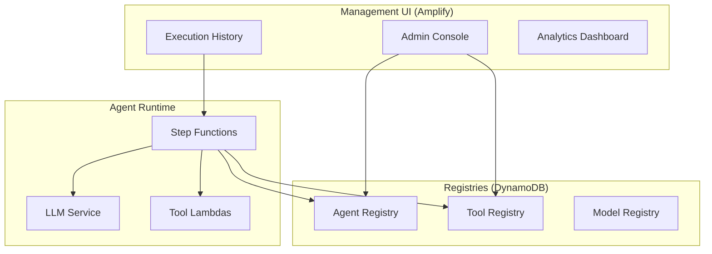
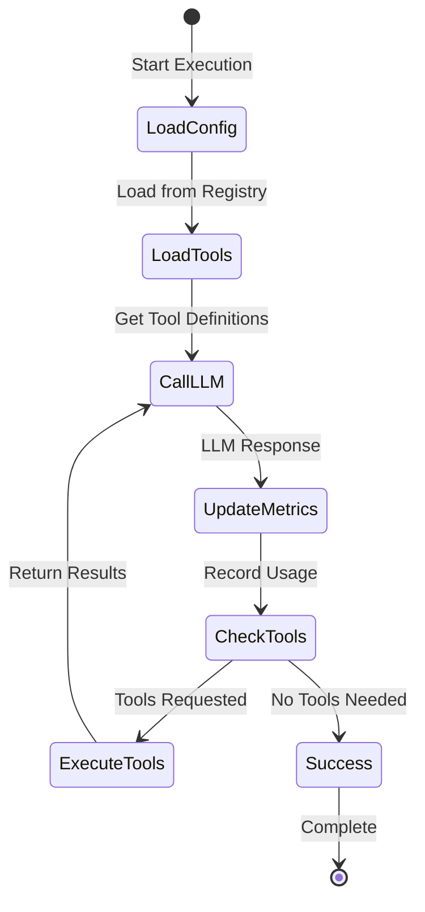

# Step Functions AI Agent Framework

> **Enterprise-Grade Serverless AI Agent Platform**
>
> Build production-ready AI agents with complete flexibility in LLM providers and tools, backed by a comprehensive management UI for enterprise operations.

## Overview

The Step Functions AI Agent Framework consists of two integrated components:

### 1. **AI Agent Runtime** (Lambda + Step Functions)
A serverless, highly flexible agent execution platform that provides:
- **Any LLM Provider**: Anthropic Claude, OpenAI GPT, Google Gemini, Amazon Bedrock, xAI Grok, DeepSeek
- **Any Programming Language**: Build tools in Python, TypeScript, Rust, Go, Java, or any language
- **Serverless Scale**: Automatic scaling with AWS Step Functions orchestration
- **Complete Observability**: Full tracing, metrics, and cost tracking built-in

### 2. **Management UI** (AWS Amplify)
A comprehensive admin interface for enterprise operations:
- **Agent Management**: Configure agents, assign tools, update LLM models
- **Tool Registry**: Manage and test tools across all agents
- **Execution Monitoring**: Real-time execution history with filtering and search
- **Cost Analytics**: Track usage and costs by agent, model, and time period
- **Enterprise Security**: IAM-integrated access, secret management, audit logging

## Key Features

### Agent Framework
- ✅ **Multi-Provider LLM Support** - Switch providers without code changes
- ✅ **Unified Rust LLM Service** - High-performance, provider-agnostic interface
- ✅ **Language-Agnostic Tools** - Build tools in any language
- ✅ **Human-in-the-Loop** - Built-in approval workflows
- ✅ **Modular Architecture** - Shared infrastructure, reusable tools
- ✅ **Long Content Support** - Handle extensive documents and conversations

### Management UI
- 📊 **Execution Dashboard** - Fast, indexed execution history with date/agent filtering
- 🔧 **Agent Configuration** - Dynamic system prompts, model selection, tool assignment
- 🧪 **Integrated Testing** - Test agents and tools directly from the UI
- 📈 **Metrics & Analytics** - CloudWatch integration, token usage, cost tracking
- 🔐 **Enterprise Security** - Cognito authentication, IAM permissions, secret manager
- 🚀 **Real-time Updates** - EventBridge-powered execution tracking

## Architecture

### Component Overview



### Agent Execution Flow



## Quick Start

### Prerequisites

- AWS Account with appropriate permissions
- Python 3.12+
- Node.js 18+ (for CDK and Amplify UI)
- AWS CDK CLI: `npm install -g aws-cdk`
- UV for Python: `pip install uv`

### Initial Setup

```bash
# Clone the repository
git clone https://github.com/your-org/step-functions-agent.git
cd step-functions-agent

# Install Python dependencies
uv pip install -r requirements.txt

# Bootstrap CDK (first time only)
cdk bootstrap

# Set environment
export ENVIRONMENT=prod
```

### Deploy Core Infrastructure

```bash
# 1. Deploy shared infrastructure (once per environment)
cdk deploy SharedInfrastructureStack-prod
cdk deploy AgentRegistryStack-prod

# 2. Deploy LLM service (choose one)
cdk deploy SharedUnifiedRustLLMStack-prod  # Recommended: High-performance unified service

# 3. Configure API keys in AWS Secrets Manager
aws secretsmanager create-secret \
    --name /ai-agent/llm-secrets/prod \
    --secret-string '{
        "ANTHROPIC_API_KEY": "sk-ant-...",
        "OPENAI_API_KEY": "sk-...",
        "GEMINI_API_KEY": "..."
    }'
```

### Deploy Management UI

```bash
cd ui_amplify

# Install dependencies
npm install

# Deploy to Amplify (creates hosted UI)
npx ampx sandbox  # For development
# OR
npx ampx pipeline-deploy --branch main  # For production
```

The UI will be available at your Amplify app URL (e.g., `https://main.xxxx.amplifyapp.com`)

## Building Your First Agent

### 1. Create Agent Stack

Create a new file `stacks/agents/my_agent_stack.py`:

```python
from aws_cdk import Fn
from stacks.agents.modular_base_agent_unified_llm_stack import ModularBaseAgentUnifiedLLMStack

class MyAgentStack(ModularBaseAgentUnifiedLLMStack):
    def __init__(self, scope, construct_id, env_name="prod", **kwargs):

        # Import required tools from registry
        db_tool_arn = Fn.import_value(f"DBInterfaceToolLambdaArn-{env_name}")

        # Configure tools for this agent
        tool_configs = [
            {
                "tool_name": "query_database",
                "lambda_arn": db_tool_arn,
                "requires_activity": False
            }
        ]

        # Define agent behavior
        system_prompt = """You are a data analyst assistant.
        Help users query and analyze database information.
        Always explain your findings clearly."""

        # Initialize agent with Unified LLM
        super().__init__(
            scope, construct_id,
            agent_name="data-analyst",
            unified_llm_arn=Fn.import_value(f"SharedUnifiedRustLLMLambdaArn-{env_name}"),
            tool_configs=tool_configs,
            env_name=env_name,
            system_prompt=system_prompt,
            **kwargs
        )
```

### 2. Register in app.py

Add to `app.py`:

```python
from stacks.agents.my_agent_stack import MyAgentStack

# Deploy your agent
MyAgentStack(app, "DataAnalystAgentStack-prod", env_name="prod")
```

### 3. Deploy

```bash
cdk deploy DataAnalystAgentStack-prod
```

The agent will automatically register in the Agent Registry and appear in the Management UI!

## Building Tools

### Tool Structure

```
lambda/tools/my-tool/
├── index.py              # Lambda handler
├── requirements.txt      # Dependencies
└── tool_definition.json  # Tool schema for LLM
```

### Tool Lambda Handler

```python
def lambda_handler(event, context):
    """
    Standard tool interface compatible with all LLM providers

    Args:
        event: {
            "name": "tool_name",
            "id": "unique_tool_use_id",
            "input": {
                # Tool-specific parameters
            }
        }

    Returns:
        {
            "type": "tool_result",
            "tool_use_id": event["id"],
            "name": event["name"],
            "content": "Result as string or JSON"
        }
    """
    tool_input = event["input"]

    # Implement tool logic
    result = perform_action(tool_input)

    return {
        "type": "tool_result",
        "tool_use_id": event["id"],
        "name": event["name"],
        "content": result
    }
```

### Tool Definition

Create `tool_definition.json`:

```json
{
  "name": "my_tool",
  "description": "Clear description of what the tool does for the LLM",
  "input_schema": {
    "type": "object",
    "properties": {
      "parameter1": {
        "type": "string",
        "description": "Description of parameter1"
      },
      "parameter2": {
        "type": "number",
        "description": "Description of parameter2"
      }
    },
    "required": ["parameter1"]
  }
}
```

### Create Tool Stack

```python
from aws_cdk import aws_lambda as lambda_, Duration
from constructs import Construct
from .base_tool_stack import BaseToolStack

class MyToolStack(BaseToolStack):
    def __init__(self, scope: Construct, construct_id: str, env_name: str = "prod", **kwargs):
        super().__init__(scope, construct_id, env_name=env_name, **kwargs)

        # Create Lambda function
        tool_lambda = lambda_.Function(
            self, "MyToolFunction",
            runtime=lambda_.Runtime.PYTHON_3_12,
            handler="index.lambda_handler",
            code=lambda_.Code.from_asset("lambda/tools/my-tool"),
            timeout=Duration.seconds(30),
            environment={
                "LOG_LEVEL": "INFO"
            }
        )

        # Register in Tool Registry
        self.register_tool(
            tool_name="my_tool",
            tool_lambda=tool_lambda,
            tool_definition_path="lambda/tools/my-tool/tool_definition.json"
        )
```

### Deploy Tool

```bash
cdk deploy MyToolStack-prod
```

The tool is now available for any agent to use!

## Built-in Tools

The framework includes production-ready tools you can use immediately:

### Data & Query Tools
- **SQL Database Tool** (`DBInterfaceToolStack`) - Query databases, execute SQL, analyze data
- **GraphQL Tool** (`GraphQLToolStack`) - Query GraphQL APIs with type safety
- **Web Research Tool** (`WebResearchToolStack`) - Web scraping and research

### Integration Tools
- **Microsoft Graph Tool** (`MicrosoftGraphToolStack`) - Office 365, Teams, SharePoint integration
- **Google Maps Tool** (`GoogleMapsToolStack`) - Location services, geocoding, directions
- **Firecrawl Tool** - Advanced web scraping with AI

### Compute Tools
- **Code Execution Tool** (`E2BToolStack`) - Safe Python/JavaScript code execution
- **Batch Processor Tool** - Process large datasets in parallel
- **Local Agent Tool** - Execute commands on remote machines securely

### Monitoring Tools
- **CloudWatch Tool** (`CloudWatchToolStack`) - AWS metrics, logs, and alarms
- **Sagemaker Tool** - ML model deployment and inference

Deploy any tool:
```bash
cdk deploy DBInterfaceToolStack-prod
cdk deploy GoogleMapsToolStack-prod
```

## Management UI Features

### Execution History
- **Fast Indexed Search** - DynamoDB-backed execution index for instant queries
- **Advanced Filtering** - Filter by agent, status, date range (UTC-aware)
- **Real-time Updates** - EventBridge integration for live execution tracking
- **Detailed Views** - Full execution trace, token usage, cost breakdown

### Agent Management
- **Dynamic Configuration** - Update system prompts without redeployment
- **Model Selection** - Switch LLM providers and models on the fly
- **Tool Assignment** - Add/remove tools from agents via UI
- **Version Control** - Track configuration changes over time

### Testing & Validation
- **Agent Testing** - Execute test prompts with custom inputs
- **Tool Testing** - Validate tool functionality independently
- **Execution Replay** - Re-run failed executions with same inputs
- **Health Checks** - Automated validation of agent configurations

### Analytics & Monitoring
- **Cost Tracking** - Real-time cost estimates per execution
- **Token Usage** - Input/output token metrics by model
- **Performance Metrics** - Execution duration, error rates, trends
- **CloudWatch Integration** - Deep-dive into logs and traces

## Enterprise Features

### Security
- ✅ **IAM Integration** - Fine-grained access control with AWS IAM
- ✅ **Cognito Authentication** - Secure user authentication for UI
- ✅ **Secrets Manager** - Encrypted storage for API keys and credentials
- ✅ **VPC Support** - Deploy in private subnets with VPC endpoints
- ✅ **Audit Logging** - Complete audit trail via CloudWatch and CloudTrail
- ✅ **Resource Tags** - Automatic tagging for compliance and cost allocation

### Observability
- ✅ **X-Ray Tracing** - End-to-end distributed tracing
- ✅ **CloudWatch Metrics** - Custom metrics for all operations
- ✅ **Structured Logging** - JSON logs with correlation IDs
- ✅ **Execution Index** - Fast searchable execution history
- ✅ **Cost Attribution** - Track costs by agent, model, and execution

### Reliability
- ✅ **Automatic Retries** - Built-in retry logic with exponential backoff
- ✅ **Error Handling** - Graceful degradation and error recovery
- ✅ **Circuit Breakers** - Protect downstream services
- ✅ **Rate Limiting** - Prevent API quota exhaustion
- ✅ **Health Checks** - Automated monitoring and alerting

### Cost Management
- ✅ **Token Tracking** - Real-time token usage monitoring
- ✅ **Cost Estimation** - Predict execution costs before running
- ✅ **Budget Alerts** - CloudWatch alarms for cost thresholds
- ✅ **Model Optimization** - Automatic model selection for cost/quality trade-offs
- ✅ **Execution Limits** - Configurable limits per agent

## LLM Providers

### Supported Providers

| Provider | Models | Best For | Pricing |
|----------|--------|----------|---------|
| **Anthropic Claude** | Sonnet 4, Opus 3.5 | Complex reasoning, long context | $$$ |
| **OpenAI** | GPT-4o, GPT-4o-mini | Versatile, code generation | $$$ |
| **Google Gemini** | 1.5 Pro, Flash | Multimodal, fast responses | $$ |
| **Amazon Bedrock** | Nova Pro, Nova Lite | AWS native, cost-effective | $$ |
| **xAI** | Grok 2, Grok 2 mini | Latest capabilities | $$ |
| **DeepSeek** | DeepSeek V3 | Specialized tasks | $ |

### Provider Configuration

All providers are configured through the Unified Rust LLM Service or individual provider Lambdas. API keys are stored in AWS Secrets Manager.

Update API keys:
```bash
aws secretsmanager update-secret \
    --secret-id /ai-agent/llm-secrets/prod \
    --secret-string '{
        "ANTHROPIC_API_KEY": "sk-ant-new-key",
        "OPENAI_API_KEY": "sk-new-key"
    }'
```

### Dynamic Model Selection

Change models via Management UI or agent configuration:

```python
# In agent stack
self.llm_provider = "anthropic"
self.llm_model = "claude-sonnet-4-20250514"

# Or via UI: Agent Management > Select Agent > Update Model
```

## Deployment Patterns

### Multi-Environment Strategy

```bash
# Development environment
export ENVIRONMENT=dev
cdk deploy SharedInfrastructureStack-dev
cdk deploy MyAgentStack-dev

# Production environment
export ENVIRONMENT=prod
cdk deploy SharedInfrastructureStack-prod
cdk deploy MyAgentStack-prod
```

### Recommended Deployment Order

1. **Core Infrastructure** (once per environment)
   ```bash
   cdk deploy SharedInfrastructureStack-prod
   cdk deploy AgentRegistryStack-prod
   ```

2. **LLM Service** (choose based on needs)
   ```bash
   # High-performance unified service (recommended)
   cdk deploy SharedUnifiedRustLLMStack-prod

   # OR traditional multi-provider
   cdk deploy SharedLLMStack-prod
   ```

3. **Tools** (deploy only what you need)
   ```bash
   cdk deploy DBInterfaceToolStack-prod
   cdk deploy GoogleMapsToolStack-prod
   cdk deploy WebResearchToolStack-prod
   ```

4. **Agents** (your custom agents)
   ```bash
   cdk deploy MyAgentStack-prod
   ```

5. **Management UI** (Amplify)
   ```bash
   cd ui_amplify
   npx ampx pipeline-deploy --branch main
   ```

## Monitoring & Operations

### CloudWatch Dashboards

Access pre-built dashboards:
- **Execution Overview** - All agent executions, success rates, duration
- **Cost Analysis** - Token usage and estimated costs by model
- **Error Tracking** - Failed executions, error patterns, retry metrics

### Example Queries

```sql
-- Cost analysis by agent
fields @timestamp, agent_name, model, input_tokens, output_tokens
| stats sum(input_tokens * 0.003 / 1000) as input_cost,
        sum(output_tokens * 0.015 / 1000) as output_cost
  by agent_name, model

-- Execution performance
fields @timestamp, agent_name, duration
| stats avg(duration) as avg_duration,
        max(duration) as max_duration,
        count() as total_executions
  by agent_name
```

### Alerts

Configure CloudWatch Alarms:
- High error rate (>5% failures)
- Slow executions (>30s duration)
- High costs (>$100/day)
- Token limit warnings

## Documentation

### Getting Started
- [Deployment Guide](docs/DEPLOYMENT_GUIDE.md) - Complete deployment walkthrough
- [Quick Start Tutorial](docs/QUICK_START.md) - Build your first agent in 10 minutes

### Development Guides
- [Agent Development](docs/AGENT_DEVELOPMENT.md) - Creating custom agents
- [Tool Development](docs/TOOL_DEVELOPMENT.md) - Building new tools
- [Testing Guide](docs/TESTING_GUIDE.md) - Testing strategies

### Advanced Topics
- [Modular Architecture](docs/MODULAR_ARCHITECTURE.md) - System design patterns
- [Long Content Support](docs/LONG_CONTENT_FEATURE.md) - Handling large documents
- [Human Approval Workflows](docs/HUMAN_APPROVAL.md) - Adding approval steps
- [Activity Testing](docs/ACTIVITY_TESTING_GUIDE.md) - Testing remote activities

### Operations
- [Monitoring Guide](docs/MONITORING.md) - Observability setup
- [Security Best Practices](docs/SECURITY.md) - Security hardening
- [Cost Optimization](docs/COST_OPTIMIZATION.md) - Reducing operational costs
- [Troubleshooting](docs/TROUBLESHOOTING.md) - Common issues and solutions

### Management UI
- [UI User Guide](ui_amplify/README.md) - Using the admin interface
- [Execution Index](ui_amplify/EXECUTION_INDEX_SUMMARY.md) - Fast execution queries
- [Analytics Dashboard](ui_amplify/docs/ANALYTICS.md) - Using metrics and analytics

## Contributing

We welcome contributions! Please see [CONTRIBUTING.md](CONTRIBUTING.md) for guidelines.

### Development Setup

```bash
# Create virtual environment
uv venv
source .venv/bin/activate

# Install dev dependencies
uv pip install -r requirements-dev.txt

# Run tests
pytest

# Format code
black .
ruff check .
```

### UI Development

```bash
cd ui_amplify

# Install dependencies
npm install

# Run local development server
npm run dev

# Run tests
npm test
```

## Project Structure

```
step-functions-agent/
├── app.py                      # CDK app entry point
├── stacks/
│   ├── agents/                 # Agent stack definitions
│   ├── tools/                  # Tool stack definitions
│   ├── shared_llm/             # LLM service stacks
│   └── infrastructure/         # Core infrastructure
├── lambda/
│   ├── tools/                  # Tool Lambda functions
│   │   ├── db-interface/
│   │   ├── google-maps/
│   │   └── web-research/
│   └── unified_llm/            # Unified LLM service (Rust)
├── ui_amplify/                 # Management UI (Amplify Gen 2)
│   ├── amplify/                # Backend configuration
│   ├── src/                    # React frontend
│   └── scripts/                # Utility scripts
└── docs/                       # Documentation
```

## Support

- **Issues**: [GitHub Issues](https://github.com/your-org/step-functions-agent/issues)
- **Discussions**: [GitHub Discussions](https://github.com/your-org/step-functions-agent/discussions)
- **Documentation**: [docs.your-project.com](https://docs.your-project.com)

## License

This project is licensed under the MIT License - see [LICENSE](LICENSE) for details.

## Acknowledgments

- AWS Step Functions team for serverless orchestration
- Anthropic, OpenAI, Google, Amazon, xAI, and DeepSeek for LLM APIs
- AWS Amplify team for the Gen 2 framework
- Open-source community for tools and libraries

---

**Built with ❤️ using AWS CDK, Step Functions, and Amplify**
