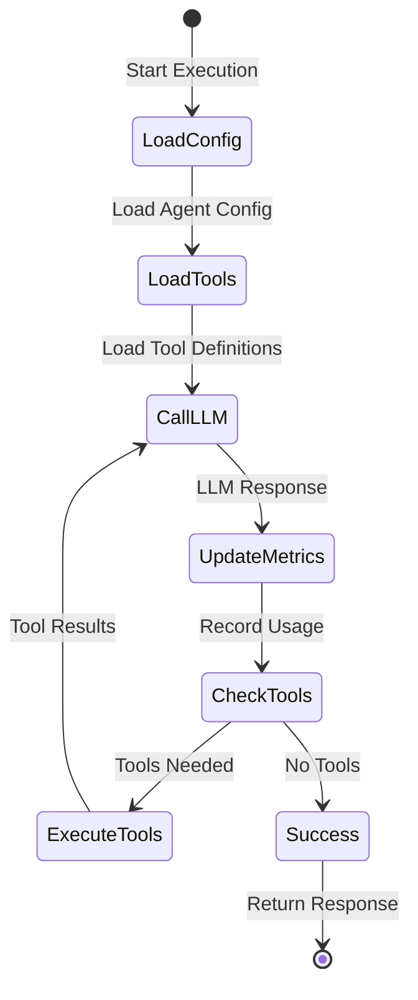

# AI Agents Framework with AWS Step Functions

> 🚀 **Enterprise-Grade AI Agent Framework**
>
> A modular, scalable framework for building production-ready AI agents using AWS Step Functions. Supporting multiple LLM providers, any programming language for tools, human approval workflows, and comprehensive observability.

## 🌟 Key Features

- **Multi-Provider LLM Support**: Anthropic Claude, OpenAI GPT, Google Gemini, Amazon Bedrock, xAI Grok, DeepSeek
- **Unified Rust LLM Service**: High-performance, provider-agnostic LLM interface
- **Modular Architecture**: Shared infrastructure, reusable tools, and independent agent deployments
- **Language Agnostic Tools**: Build tools in Python, TypeScript, Rust, Go, Java, or any language
- **Human-in-the-Loop**: Built-in approval workflows for sensitive operations
- **Long Content Support**: Handle extensive documents and conversations
- **Enterprise Ready**: Full observability, cost tracking, and security best practices

## 📚 Table of Contents

- [Architecture Overview](#-architecture-overview)
- [Quick Start](#-quick-start)
- [Modular Stack Structure](#-modular-stack-structure)
- [Deployment Guide](#-deployment-guide)
- [Creating New Agents](#-creating-new-agents)
- [Building Tools](#-building-tools)
- [LLM Providers](#-llm-providers)
- [Monitoring & Observability](#-monitoring--observability)
- [Documentation](#-documentation)

## 🏗 Architecture Overview

### Modern Modular Architecture

```mermaid
graph TB
    subgraph "Shared Infrastructure Layer"
        SharedInfra[Shared Infrastructure Stack]
        AgentRegistry[Agent Registry]
        ToolRegistry[Tool Registry]
        LLMModels[LLM Models Table]
    end

    subgraph "LLM Layer"
        SharedLLM[Shared LLM Stack<br/>Claude, OpenAI, Gemini]
        UnifiedRust[Unified Rust LLM<br/>High Performance]
    end

    subgraph "Tools Layer"
        DBTool[Database Tool]
        MapsTool[Google Maps Tool]
        MSGraphTool[Microsoft Graph Tool]
        WebTool[Web Research Tool]
        CodeTool[Code Execution Tool]
    end

    subgraph "Agent Layer"
        SQLAgent[SQL Agent]
        ResearchAgent[Research Agent]
        AutomationAgent[Automation Agent]
    end

    Agent Layer --> LLM Layer
    Agent Layer --> Tools Layer
    LLM Layer --> SharedInfra
    Tools Layer --> SharedInfra
```

### Step Functions Agent Workflow



## 🚀 Quick Start

### Prerequisites

- AWS Account with appropriate permissions
- Python 3.12+
- Node.js 18+ (for CDK)
- AWS CDK CLI (`npm install -g aws-cdk`)
- UV for Python dependency management

### Installation

```bash
# Clone the repository
git clone https://github.com/your-org/step-functions-agent.git
cd step-functions-agent

# Install dependencies using UV
uv pip install -r requirements.txt

# Bootstrap CDK (first time only)
cdk bootstrap

# Deploy shared infrastructure first
cdk deploy SharedInfrastructureStack-prod SharedLLMStack-prod AgentRegistryStack-prod

# Deploy tools
cdk deploy DBInterfaceToolStack-prod GoogleMapsToolStack-prod

# Deploy an agent
cdk deploy SQLAgentUnifiedLLMStack-prod
```

## 📦 Modular Stack Structure

### Shared Stacks (Deploy Once)

| Stack | Purpose | Resources |
|-------|---------|-----------|
| `SharedInfrastructureStack` | Core infrastructure | Tool Registry, Content Storage |
| `SharedLLMStack` | Traditional LLM providers | Claude, OpenAI, Gemini Lambda functions |
| `SharedUnifiedRustLLMStack` | High-performance LLM | Rust-based unified provider |
| `AgentRegistryStack` | Agent configurations | DynamoDB table for agents |

### Tool Stacks (Deploy as Needed)

| Tool | Stack | Language | Purpose |
|------|-------|----------|---------|
| Database | `DBInterfaceToolStack` | Python | SQL database operations |
| Google Maps | `GoogleMapsToolStack` | TypeScript | Location services |
| Microsoft Graph | `MicrosoftGraphToolStack` | Python | Office 365 integration |
| Web Research | `WebResearchToolStack` | Python | Web scraping and research |
| Code Execution | `E2BToolStack` | Python | Safe code execution |
| Finance | `FinancialToolStack` | Python | Market data analysis |
| CloudWatch | `CloudWatchToolStack` | Python | AWS metrics and logs |

### Agent Stacks

| Agent | Stack | Tools Used | Use Case |
|-------|-------|------------|----------|
| SQL Agent | `SQLAgentUnifiedLLMStack` | Database, Code | Data analysis & reporting |
| Research Agent | `WebResearchAgentUnifiedLLMStack` | Web Research, Code | Market research |
| Automation Agent | `TestAutomationRemoteAgentStack` | Local Execute, MS Graph | Enterprise automation |
| Maps Agent | `GoogleMapsAgentUnifiedLLMStack` | Google Maps | Location intelligence |

## 🚢 Deployment Guide

### Environment-Based Deployment

```bash
# Development environment
export ENVIRONMENT=dev
cdk deploy SharedInfrastructureStack-dev

# Production environment
export ENVIRONMENT=prod
cdk deploy SharedInfrastructureStack-prod
```

### Deployment Order

1. **Shared Infrastructure** (once per environment)
   ```bash
   cdk deploy SharedInfrastructureStack-prod
   cdk deploy AgentRegistryStack-prod
   ```

2. **LLM Services** (choose one or both)
   ```bash
   # Traditional multi-provider
   cdk deploy SharedLLMStack-prod
   
   # OR High-performance unified
   cdk deploy SharedUnifiedRustLLMStack-prod
   ```

3. **Tools** (deploy only what you need)
   ```bash
   cdk deploy DBInterfaceToolStack-prod
   cdk deploy GoogleMapsToolStack-prod
   ```

4. **Agents** (deploy your agents)
   ```bash
   cdk deploy SQLAgentUnifiedLLMStack-prod
   ```

## 🛠 Creating New Agents

### Using the Modular Base Class

```python
from stacks.agents.modular_base_agent_unified_llm_stack import ModularBaseAgentUnifiedLLMStack

class MyCustomAgentStack(ModularBaseAgentUnifiedLLMStack):
    def __init__(self, scope, construct_id, env_name="prod", **kwargs):
        
        # Import tool ARNs
        tool1_arn = Fn.import_value(f"Tool1LambdaArn-{env_name}")
        tool2_arn = Fn.import_value(f"Tool2LambdaArn-{env_name}")
        
        # Define tool configurations
        tool_configs = [
            {
                "tool_name": "tool1",
                "lambda_arn": tool1_arn,
                "requires_activity": False
            },
            {
                "tool_name": "tool2", 
                "lambda_arn": tool2_arn,
                "requires_activity": True,
                "activity_type": "human_approval"
            }
        ]
        
        # System prompt
        system_prompt = "You are a helpful assistant..."
        
        # Call parent constructor
        super().__init__(
            scope, construct_id,
            agent_name="my-custom-agent",
            unified_llm_arn=Fn.import_value(f"SharedUnifiedRustLLMLambdaArn-{env_name}"),
            tool_configs=tool_configs,
            env_name=env_name,
            system_prompt=system_prompt,
            **kwargs
        )
```

## 🔧 Building Tools

### Tool Structure

```
lambda/tools/my-tool/
├── index.py           # Lambda handler
├── requirements.txt   # Dependencies
└── template.yaml     # SAM template (optional)
```

### Tool Lambda Handler Example

```python
def lambda_handler(event, context):
    """
    Standard tool interface
    
    Args:
        event: {
            "name": "tool_name",
            "id": "unique_id",
            "input": { ... tool specific input ... }
        }
    
    Returns:
        {
            "type": "tool_result",
            "tool_use_id": event["id"],
            "name": event["name"],
            "content": "Tool execution result"
        }
    """
    tool_input = event["input"]
    
    # Tool logic here
    result = perform_tool_action(tool_input)
    
    return {
        "type": "tool_result",
        "tool_use_id": event["id"],
        "name": event["name"],
        "content": result
    }
```

### Registering Tools

Tools are automatically registered in the Tool Registry when deployed. The registry entry includes:

```python
{
    "tool_name": "my_tool",
    "description": "Tool description for LLM",
    "input_schema": {
        "type": "object",
        "properties": { ... },
        "required": [ ... ]
    },
    "lambda_arn": "arn:aws:lambda:...",
    "created_at": "2024-01-01T00:00:00Z"
}
```

## 🤖 LLM Providers

### Supported Providers

| Provider | Models | Stack | Notes |
|----------|--------|-------|-------|
| Anthropic | Claude 3.5 Sonnet, Claude 3 Opus | SharedLLMStack | Best for complex reasoning |
| OpenAI | GPT-4o, GPT-4o-mini | SharedLLMStack | Versatile, good for code |
| Google | Gemini 1.5 Pro, Flash | SharedLLMStack | Multimodal capabilities |
| Amazon | Nova Pro, Nova Lite | SharedUnifiedRustLLMStack | AWS native, cost-effective |
| xAI | Grok 2, Grok 2 mini | SharedUnifiedRustLLMStack | Latest models |
| DeepSeek | DeepSeek V3 | SharedUnifiedRustLLMStack | Specialized capabilities |

### Configuring API Keys

```bash
# Store API keys in AWS Secrets Manager
aws secretsmanager create-secret \
    --name /ai-agent/llm-secrets/prod \
    --secret-string '{
        "ANTHROPIC_API_KEY": "sk-ant-...",
        "OPENAI_API_KEY": "sk-...",
        "GEMINI_API_KEY": "..."
    }'
```

### Dynamic Model Selection

Agents can dynamically select models based on the task:

```python
# In agent configuration
self.llm_provider = "anthropic"  # or "openai", "google", etc.
self.llm_model = "claude-3-5-sonnet-20241022"
```

## 📊 Monitoring & Observability

### CloudWatch Metrics

- **Token Usage**: Input/output tokens per model
- **Execution Time**: Agent and tool execution duration
- **Error Rates**: Failed executions and retries
- **Cost Tracking**: Estimated costs per execution

### X-Ray Tracing

All Step Functions executions include X-Ray tracing for detailed performance analysis:

```bash
# View traces in AWS Console
AWS Console > CloudWatch > Service Map
```

### Cost Analysis

```sql
-- CloudWatch Insights query for cost analysis
fields @timestamp, agent, model, input_tokens, output_tokens
| stats sum(input_tokens) as total_input,
        sum(output_tokens) as total_output
        by model
```

## 📖 Documentation

### Core Documentation

- [Deployment Guide](docs/DEPLOYMENT_GUIDE.md) - Detailed deployment instructions
- [Architecture Overview](docs/MODULAR_ARCHITECTURE.md) - System design and patterns
- [Agent Development](docs/AGENT_DEVELOPMENT.md) - Creating custom agents
- [Tool Development](docs/TOOL_DEVELOPMENT.md) - Building new tools
- [LLM Provider Setup](docs/LLM_PROVIDER_SETUP.md) - Configuring providers

### Advanced Topics

- [Long Content Support](docs/LONG_CONTENT_FEATURE.md) - Handling large documents
- [Human Approval Workflows](docs/HUMAN_APPROVAL.md) - Adding approval steps
- [Activity Testing](docs/ACTIVITY_TESTING_GUIDE.md) - Testing remote activities
- [Security Best Practices](docs/SECURITY.md) - Security considerations

### Migration Guides

- [Legacy Migration](docs/MIGRATION_GUIDE.md) - Migrating from old architecture
- [Provider Migration](docs/PROVIDER_MIGRATION.md) - Switching LLM providers

## 🤝 Contributing

We welcome contributions! Please see our [Contributing Guide](CONTRIBUTING.md) for details.

### Development Setup

```bash
# Create virtual environment
uv venv
source .venv/bin/activate

# Install dev dependencies
uv pip install -r requirements-dev.txt

# Run tests
pytest

# Format code
black .
```

## 📜 License

This project is licensed under the MIT License - see the [LICENSE](LICENSE) file for details.

## 🙏 Acknowledgments

- AWS Step Functions team for the serverless orchestration platform
- Anthropic, OpenAI, and Google for their LLM APIs
- The open-source community for various tools and libraries

## 📞 Support

- **Issues**: [GitHub Issues](https://github.com/your-org/step-functions-agent/issues)
- **Discussions**: [GitHub Discussions](https://github.com/your-org/step-functions-agent/discussions)
- **Documentation**: [Full Documentation](https://your-docs-site.com)

---

Built with ❤️ using AWS CDK and Step Functions