# Building and Operating AI Agents in AWS Step Functions

> 📦 **Enterprise AI Agent Framework**
>
> Extreme flexibility and scalability for enterprise grade AI Agents. Supporting all LLMs and tools in any programming language. Including human approval and observability. All in a single framework.
> ___

## Table of Contents

- [AI Agent Overview](#ai-agent-overview)
  - [Step Functions Graph for SQL AI Agent](#step-functions-graph-for-sql-ai-agent)
- [MLOps of AI Agents](#mlops-of-ai-agents)
- [Comparison with Other AI-Agent Frameworks](#comparison-with-other-ai-agent-frameworks)
- [Project Folder Structure](#project-folder-structure)
- [AI Agent Implementation](#ai-agent-implementation)
- [Building Tools using AWS Lambda](#building-tools)
- [Building the LLM caller](#building-the-llm-caller)
- [Building the AI Agent using Step Function](#building-the-ai-agent-step-function)
  - [Defining the tools](#defining-the-tools)
- [Create the AI Agent Step Function](#create-the-ai-agent-step-function)
- [Data Communication](#data-communication)
  - [Save data to S3 as tool output](#save-data-to-s3-as-tool-output)
  - [Read data from S3 as tool input](#read-data-from-s3-as-tool-input)
- [Human Approval](#human-approval)
- [UI for the AI Agent](#ui-for-the-ai-agent)
- [Create a new Python tool](#create-a-new-python-tool)
- [Security](#security)
- [Pre-requisites](#pre-requisites)
- [uv Set up](#uv-set-up)
- [Deploying the AI Agent Step Function using CDK](#deploying-the-ai-agent-step-function-using-cdk)
- [Refactored Architecture (New)](#refactored-architecture-new)
  - [Other CDK commands](#other-cdk-commands)
- [Monitoring](#monitoring)

## AI Agent Overview

AI Agents are a combination of LLMs and Tools. Each tool is used to perform a specific task, and the LLM orchestrates them to perform complex tasks, requested by the user. AI Agents are a powerful tool for automating complex tasks in the cloud, and they are a great way to reduce the cost of building and maintaining complex systems. However, the deployment and operation of AI Agents can be a complex process.

This repository provides a robust implementation of AI Agents in AWS Step Functions, which is a serverless computing platform for building and deploying serverless applications. The repository contains the implementation of a few AI Agents:

- SQL AI Agent, which can analyze a SQL database with multiple tables, and answer business questions about the data, including visualization and reporting, in **Python** .
- Financial AI Agent, which can analyze a financial dataset with multiple tables, and answer business questions about the data, including visualization and reporting, in Python , using YFinance library.
- Google Maps AI Agent, which can analyze a Google Maps dataset with multiple tables, and answer business questions about the data, including visualization and reporting, in **TypeScript** .
- Time Series Clustering AI Agent, which can analyze a time series dataset with multiple tables, and answer business questions about the data, including visualization and reporting, in **Rust** .
- Time Series Analysis AI Agent, which can analyze a large set of time series, and answer business questions about the data, including visualization and reporting, in **Java** .
- Web Research AI Agent, which uses Perplexity to analyze web pages, and answer business questions about companies, in **Go** .

The implementation should be used as a template for building a custom AI Agent for any specific use case.

You can read more in [this blog post](https://medium.com/@guyernest/building-scalable-ai-agents-with-aws-step-functions-a-practical-guide-1e4f6dd19764).

### Step Functions Graph for SQL AI Agent


## Comprehensive Architecture Diagram

The following diagram provides a detailed view of the complete AI Agent architecture, including Step Functions flow, message transformations, LLM handlers, tool execution, and monitoring integration:

```mermaid
flowchart TD
    %% High-Level Architecture Overview
    subgraph "AI Agent Architecture Overview"
        direction TB
        
        %% Input Layer
        UserRequest["`🔥 **User Request**
        Natural language query`"] 
        
        %% Core Processing Flow
        UserRequest --> StepFunction["`⚡ **Step Functions Agent**
        Orchestrates LLM + Tool execution`"]
        
        StepFunction --> LLMChoice{"`**Choose LLM**
        Claude | OpenAI | Gemini`"}
        
        LLMChoice -->|Claude| ClaudeLLM["`🤖 **Claude Lambda**
        Anthropic API`"]
        LLMChoice -->|OpenAI| OpenAILLM["`🤖 **OpenAI Lambda**
        GPT API`"]  
        LLMChoice -->|Gemini| GeminiLLM["`🤖 **Gemini Lambda**
        Google API`"]
        
        %% Tool Execution Layer
        ClaudeLLM --> ToolChoice{"`**Tool Required?**`"}
        OpenAILLM --> ToolChoice
        GeminiLLM --> ToolChoice
        
        ToolChoice -->|Yes| ToolExecution["`🔧 **Tool Execution**
        Parallel Lambda calls`"]
        ToolChoice -->|No| Response["`✅ **Final Response**
        Back to user`"]
        
        %% Tool Types
        ToolExecution --> DBTools["`💾 **Database Tools**
        Schema + SQL queries`"]
        ToolExecution --> MapsTools["`🗺️ **Maps Tools**
        Location services`"]
        ToolExecution --> CodeTools["`💻 **Code Tools**
        Python execution`"]
        ToolExecution --> FinTools["`💰 **Finance Tools**
        Market data`"]
        
        %% Back to LLM for response
        DBTools --> ToolChoice
        MapsTools --> ToolChoice
        CodeTools --> ToolChoice
        FinTools --> ToolChoice
        
        %% Monitoring Layer
        StepFunction -.-> Monitoring["`📊 **CloudWatch Monitoring**
        Metrics + Costs + Errors`"]
    end

    %% Simplified Step Functions Flow
    subgraph "Step Functions Execution Details"
        direction TB
        
        SFStart(["`🚀 **Start Agent**`"]) --> LoadConfig["`📋 **Load Configuration**
        Agent Registry + Tool Registry`"]
        
        LoadConfig --> CallLLM["`🤖 **Call LLM**
        Send messages + available tools`"]
        
        CallLLM --> RecordMetrics["`📊 **Record Metrics**
        Token usage to CloudWatch`"]
        
        RecordMetrics --> CheckDone{"`❓ **Check if Done**
        Any tool calls needed?`"}
        
        CheckDone -->|No tools| SFEnd(["`✅ **Return Response**`"])
        CheckDone -->|Use tools| ExecuteTools["`🔧 **Execute Tools**
        Parallel Lambda execution`"]
        
        ExecuteTools --> AppendResults["`📝 **Append Results**
        Add tool outputs to conversation`"]
        
        AppendResults --> CallLLM
    end

    %% Technology Stack Summary
    subgraph "Technology Stack"
        direction LR
        
        Infrastructure["`🏗️ **Infrastructure**
        • AWS CDK (Python)
        • Step Functions (JSONata)
        • Lambda Functions
        • DynamoDB (Registries)`"]
        
        LLMProviders["`🤖 **LLM Providers**
        • Anthropic Claude
        • OpenAI GPT
        • Google Gemini
        • AWS Bedrock`"]
        
        Tools["`🔧 **Tool Categories**
        • Database (SQLite)
        • Maps (Google APIs)  
        • Code (Python/E2B)
        • Finance (Yahoo)
        • Web (Scraping)`"]
        
        Monitoring["`📊 **Observability**
        • CloudWatch Dashboards
        • Token Usage Metrics
        • Cost Tracking
        • Error Monitoring`"]
    end
```



### Key Architecture Components

#### 1. **CDK Stack Organization**
- **SharedInfrastructureStack**: Provides DynamoDB registries for agents and tools
- **SharedLLMStack**: Centralized LLM Lambda functions supporting multiple providers
- **Individual Tool Stacks**: Each tool stack manages its own Lambda functions and exports
- **Agent Stacks**: Step Functions workflows with agent-specific configurations
- **AgentMonitoringStack**: Comprehensive observability with real-time dashboards and cost tracking

#### 2. **Monitoring and Observability**
- **Real-time Token Metrics**: Track input/output tokens per agent across all LLM providers
- **Cost Analysis Dashboard**: Automated cost calculation with current pricing for GPT-4o, Claude-3-7, Gemini-2.5, Nova Pro, and Grok-2
- **Multi-dimensional Metrics**: Uses `agent`, `model`, and `state_machine_name` dimensions for precise tracking
- **Lambda Performance**: Monitor invocations, errors, and performance across all tool and LLM functions
- **Step Functions Monitoring**: Track execution success/failure rates and workflow performance
- **Dynamic Configuration**: All monitoring automatically adapts to deployed resource names - no hardcoding

#### 3. **Step Functions State Management**
- **JSONata Expressions**: Used throughout for data transformation and routing
- **Dynamic Tool Loading**: Agent and tool configurations loaded from DynamoDB at runtime
- **Message Conversation**: Maintains full conversation history across LLM calls
- **Error Handling**: Comprehensive retry logic and fallback mechanisms

#### 4. **LLM Provider Abstraction**
- **Unified Interface**: All LLM handlers conform to the same input/output format
- **Provider-Specific Handling**: Each handler manages API-specific requirements
- **Message Normalization**: Consistent message format regardless of LLM provider
- **Token Tracking**: Standardized metrics collection across all providers

#### 4. **Tool Execution Framework**
- **Multi-Language Support**: Tools can be implemented in Python, TypeScript, Rust, Java, Go
- **Standardized Interface**: All tools receive and return consistent message formats
- **Dynamic Routing**: Step Functions routes to appropriate Lambda based on tool name
- **Result Formatting**: Tool outputs are automatically formatted for LLM consumption

#### 5. **Monitoring and Observability**
- **Real-Time Metrics**: Token usage, costs, errors, and performance metrics
- **Cost Attribution**: Per-model and per-agent cost tracking and analysis
- **Error Tracking**: Comprehensive error detection and alerting
- **Performance Analytics**: Latency and throughput monitoring across all components

#### 6. **Monitoring Implementation Lessons Learned**

##### Dynamic Resource Configuration
- **Challenge**: Hardcoded monitoring configurations break when resource names change
- **Solution**: Use CDK construct properties (`agent.state_machine_name`, `lambda.function_name`) for dynamic configuration
- **Benefit**: Monitoring automatically adapts to naming changes and environment differences

##### Multi-dimensional Metrics Architecture
- **Challenge**: Simple metrics don't provide enough granularity for cost analysis and debugging
- **Solution**: Implemented three-dimensional metrics (`agent`, `model`, `state_machine_name`) in Step Functions
- **Benefit**: Enables precise cost tracking per model and detailed performance analysis per agent

##### CloudWatch Metric Math Best Practices
- **Issue**: Python underscore separators (`1_000_000`) cause CloudWatch math expression syntax errors
- **Fix**: Use plain numbers (`1000000`) in CloudWatch metric math expressions
- **Issue**: SEARCH expressions must match exact dimension structure from metric sources
- **Fix**: Align monitoring queries with actual Step Functions metric dimensions structure

##### Model Evolution and Cost Tracking
- **Challenge**: LLM providers frequently update model names and pricing
- **Solution**: Centralized model configuration in monitoring stack with current pricing
- **Current Models**: GPT-4o, Claude-3-7-sonnet-latest, Gemini-2.5-flash, Amazon Nova Pro, Grok-2
- **Maintenance**: Regular updates needed when providers change model names or pricing

This architecture provides enterprise-grade scalability, observability, and maintainability while supporting any combination of LLM providers and tool implementations.

## 🚀 Latest Feature: Activity Support (Human Approval & Remote Execution)

The framework now includes comprehensive **Activity Support** for enterprise-grade AI agents with human oversight and remote execution capabilities:

### 🔐 **Human Approval Workflow**
- **Agent-owned activities**: Single approval activity per agent for all approval-required tools
- **Rich rejection feedback**: Structured responses help LLM learn and improve subsequent attempts
- **1-hour timeout**: Configurable timeout with proper error handling
- **Use Cases**: SQL queries, code execution, financial transactions, data modifications

### 🌐 **Remote Execution Workflow**
- **Tool-owned activities**: Each remote tool manages its own execution activity
- **5-minute timeout**: Appropriate for remote command execution and automation
- **Distributed processing**: Execute tools on remote systems via Step Functions Activities
- **Use Cases**: Local automation, RPA, remote command execution, desktop automation

### 📋 **Test Agents Available**
- **TestSQLApprovalAgent**: Demonstrates human approval for database operations
- **TestAutomationRemoteAgent**: Demonstrates remote execution for local automation

### 🛠️ **Quick Test**
```bash
# Deploy test agents
python test_approval_agents.py deploy

# Start activity workers (in separate terminal)
python activity_worker.py both

# Run test scenarios
python test_approval_agents.py test
```

See [Activity Testing Guide](docs/ACTIVITY_TESTING_GUIDE.md) and [Modular Architecture](docs/MODULAR_ARCHITECTURE.md) for complete documentation.

## MLOps of AI Agents

There are a few frameworks for MLOps of AI Agents, such as: LangGraph, Crew.ai, Pydanic AI, etc. There are also some cloud platforms that can be used to build and deploy AI Agents, such as Amazon Bedrock, Google Vertex AI, and Azure OpenAI. There are cons and pros for each of these frameworks and platforms. The proposed implementation of AI Agents in AWS Step Functions is solving most of the problems with the existing frameworks and platforms.

## Comparison with Other AI-Agent Frameworks

The following table compares the proposed implementation of AI Agents in AWS Step Functions with other MLOps frameworks on the aspects of scalability, multi language support, observability, and cost:

| Framework | Scalability | Multi<br/>Language<br/>Support | Multi-LLM<br/>Support | Observability | Cost |
| --- | --- | --- | --- | --- | --- |
| AI Agents in AWS<br/> Step Functions | High | High | High | High | Low |
| Amazon Bedrock | Medium | Medium | Low | Medium | High |
| LangGraph | Medium | Medium | Medium | Low | High |
| Crew.ai | High | Medium | Medium | Medium | High |
| Pydanic AI | Medium | Medium | Medium | Low | High |

The proposed implementation of AI Agents in AWS Step Functions has many advantages, such as:

- Scalability: High scalability, as the number of tasks that can be executed is limited only by the resources of the AWS account.
- Multi Language Support: The tools can be implemented in any programming language, allowing for the use of the best language for each task.
- Multi-LLM Support: High flexibility in LLM integration, allowing connection to any LLM provider (OpenAI, Anthropic, Gemini, Nova, Llama, etc.) through Lambda functions.
- Observability: High observability, as the state of each task is stored in the Step Function, and can be queried at any time, as well as built-in integration with CloudWatch and X-Ray.
- Cost: Low cost, as the cost of using Serverless Lambda and Step Functions is much lower than using other AI-Agent frameworks.

The other frameworks have some limitations, such as:

- Amazon Bedrock (or Azure AI/ Google AI and other vendor specific): Limited model support, as the number of LLM that can be used is limited (No OpenAI's GPT or Google's Gemini, for example).
- LangGraph: Limited scalability, as the number of tasks that can be executed is limited by the resources of the LangGraph cluster.
- Crew.ai: Great built-in support but limited flexibility for new tools and LLMs.
- Pydanic AI: Limited scalability, as you have to manage the resources of the server where the AI Agent is running.

## Project Folder Structure

### Lambda

- **lambda/call_llm/** *(Lambda functions to call the various LLM)*
  - [`README.md`](lambda/call_llm/README.md) *(Documentation on building the LLM callers)*
  - `lambda_layer/` (Lambda layer shared by all the LLM callers)
  - `functions/` (Specific LLM providers)
    - `anthropic_llm/` (for Claude)
    - `openai_llm/` (for GPT and DeepSeek)
    - `bedrock_llm/` (for Jamba and Nova)
    - `gemini_llm/` (for Gemini)
  - `tests/`
- **lambda/tools/** *(Lambda functions for the tools in various programming languages)*
  - [`README.md`](lambda/tools/README.md) *(Documentation on building the tools)*
  - `code-interpreter/`
  - `db-interface/`
  - `graphql-interface/`
  - `cloudwatch-queries/`
  - `google-maps/`
  - `rust-clustering/`
  - `stock-analyzer/`
  - `web-research/`
  = `web-scraper/`

### Step Functions Agent

- **step_functions_agent/** *(CDK stacks and constructs for the various AI Agents)*
  - [`README.md`](step_functions_agent/README.md) *(Documentation on building the AI Agents in AWS Step Functions)*
  - `ai_agent_construct_from_json.py`
  - `ai_supervisor_agent_construct_from_json.py`
  - `step_functions_sql_agent_stack.py`
  - `step_functions_analysis_agent_stack.py`
  - `step_functions_clustering_agent_stack.py`
  - `step_functions_research_agent_stack.py`
  - `step_functions_graphql_agent_stack.py`
  - `step_functions_cloudwatch_agent_stack.py`
  - `step_functions_books_agent_stack.py`
  - `step_functions_web_scraper_agent_stack.py`
  - `step_functions_supervisor_agent_stack.py`
  - `step_functions_agent_monitoring_stack.py`

### Step Functions

- **step-functions/** *(Step Functions JSON templates)*
  - `agent-with-tools-flow-template.json`
  - `supervisor-agent-flow-template.json`

### UI

- **ui/** *(User Interface for the AI Agent using FastHTML)*
  - `call_agent.py`
  - `requirements.txt`
  - `test_chat_display.py`

### Root Files

- [`README.md`](README.md) *(This file)*
- `app.py` *(Main CDK application file)*
- `cdk.json`
- `requirements.txt`
- `template.yaml`

## AI Agent Implementation

The AI Agent implementation in AWS Step Functions is based on the following steps:

1. Develop Lambda functions which are the tools for the AI Agent. These functions can be used to perform complex tasks, such as calling APIs, querying databases, etc. The functions can be implemented using **any programming language**, such as Python, TypeScript, Java, Rust, etc.
2. Develop Lambda function which calls **your preferred LLM** for the AI Agent.
3. Create a Step Function which orchestrate the AI Agent. This Step Function calls the LLM and passes the request to the tools, and returns the results to the LLM.

This repository contains an example of some tools that are used to build SQL, Financial, Google Maps, and Time Series Clustering Agents. Each Lambda function is implemented under the `lambda` directory. The `CDK` stack integrates all the Lambda functions into the Step Function flow to build the AI Agent.

Please note that each Lambda function is implemented in a dedicated directory and has its own dependencies file. The examples for the different programming languages are:

-  Python: [lambda/tools/graphql-interface](lambda/tools/graphql-interface) - using [uv](https://github.com/astral-sh/uv) to build the requirements.txt file from the requirements.in file, or using SAM template for AWS Lambda.
-  TypeScript: [lambda/tools/google-maps](lambda/tools/google-maps) - using tsconfig.json for dependencies.
-  Rust: [lambda/tools/rust-clustering](lambda/tools/rust-clustering) - using Cargo.toml for dependencies.
-  Java: [lambda/tools/stock-analyzer](lambda/tools/stock-analyzer) - using Maven to build the jar based on the pom.xml.
-  Go: [lambda/tools/web-research](lambda/tools/web-research) - using mod.go for dependencies.

## Building Tools

Each tool is implemented using a Lambda function in a dedicated directory, and has its own build requirements and dependencies. You can see more examples and documentation in the [lambda/tools](lambda/tools) folder.

### Using Cookiecutter

The project includes a set of [cookiecutters](https://github.com/cookiecutter/cookiecutter) to help you create new tools. You can find them in the [lambda/cookiecutter](lambda/cookiecutter) folder. The cookiecutters are available for Python, TypeScript, and Rust.

To use a cookiecutter, run the following command:

```shell
cd lambda/tools
cookiecutter ../cookiecutter/python # or typescript, or rust
```

### Building from scratch

A tool should know how to parse the tool input, and return the tool output. The tool input is passed to the tool as a JSON object, and the tool output is returned as a JSON object. For example, the following [Lambda function](lambda/tools/db-interface/index.py) implements two tools: `get_db_schema` and `execute_sql_query`:

```python
def lambda_handler(event, context):
    # Get the tool name from the input event
    tool_use = event
    tool_name = tool_use['name']
    tool_input = tool_use['input']

    db = SQLDatabase(DB_NAME)

    # Once the db is ready, execute the requested method on the db
    match tool_name:
        case 'get_db_schema':
            result = db.get_db_schema()
        case 'execute_sql_query':
            # The SQL provided might cause ad error. We need to return the error message to the LLM
            # so it can fix the SQL and try again.
            try:
                result = db.execute_sql_query(tool_input['sql_query'])
            except sqlite3.OperationalError as e:
                result = json.dumps({
                    'error': str(e)
                })
        case _:
            result = json.dumps({
                'error': f"Unknown tool name: {tool_name}"
            })
```

The output of this Lambda function is a JSON object, which is passed to the LLM as the tool output.

```python
return {
      "type": "tool_result",
      "name": tool_name,
      "tool_use_id": tool_use["id"],
      "content": result
}
```

## Building the LLM caller

The LLM caller is implemented using a Lambda function. The LLM caller is called by the `CDK` stack, and it calls the LLM API, with the tools option ("function calling"), and returns the LLM response. Please note that the code below (and in [this repo implementation](lambda/call_llm/README.md)) is the format for:

- [Claude](https://docs.anthropic.com/en/docs/build-with-claude/tool-use) models from Anthropic.
- [GPT](https://platform.openai.com/docs/guides/function-calling) models from OpenAI.
- [Jamba](https://docs.ai21.com/reference/jamba-15-api-ref) models from AI21, through [AWS Bedrock InvokeModel API](https://docs.aws.amazon.com/bedrock/latest/APIReference/API_runtime_InvokeModel.html#API_runtime_InvokeModel_RequestBody).
- [Gemini](https://gemini.google.com/) models from Google.
- [XAI](https://x.ai/api/) models from x.ai (aka Grok).
- [DeepSeek](https://deepseek.com/) models from DeepSeek (tool calling is still not supported well, but the code is ready for it).

However, the tool usage is very similar to other LLM, such as FAIR [Llama](https://github.com/meta-llama/llama-models/blob/main/models/llama3_3/prompt_format.md#json-based-tool-calling), etc.

### API Keys

The API keys are stored in AWS Secrets Manager, after they are uploaded from the local `.env` file by the first `cdk deploy` command.

```text
ANTHROPIC_API_KEY=your_anthropic_api_key
OPENAI_API_KEY=your_openai_api_key
AI21_API_KEY=your_ai21_api_key
GEMINI_API_KEY=your_gemini_api_key
... other API keys
```

### Lambda Function

```python
ANTHROPIC_API_KEY = json.loads(parameters.get_secret("/ai-agent/api-keys"))["ANTHROPIC_API_KEY"]
anthropic_client = anthropic.Anthropic(api_key=ANTHROPIC_API_KEY)

def lambda_handler(event, context):
    # Get system, messages, and model from event
    system = event.get('system')
    messages = event.get('messages')
    tools = event.get('tools', [])

    try:
        response = anthropic_client.messages.create(
            system = system,
            model=model,
            max_tokens=4096,
            tools=tools,
            messages=messages
        )

        assistant_message = convert_claude_message_to_json(response)

        # Update messages to include Claude's response
        messages.append(assistant_message["message"])

        return {
            'statusCode': 200,
            'body': {
                'messages': messages,
                'metadata' : assistant_message["metadata"]
            }
        }
    except Exception as e:
        logger.error(e)
        return {
            'statusCode': 500,
            'body': json.dumps({
                'error': str(e)
            })
        }
```

## Building the AI Agent Step Function

Once we have the LLM caller, and the tools, we can build the AI Agent Step Function, which is implemented in the `CDK` stack, using the  [stack definition](step_functions_sql_agent/step_functions_sql_agent_stack.py). The stack uses a local construct that reads a [template](step-functions/agent-with-tools-flow-template.json) of the Amazon Step Functions Language (ASL) to create the AI Agent Step Functions Flow. The construct is implemented in the [ai_agent_construct_from_json.py](step_functions_sql_agent/ai_agent_construct_from_json.py) file.

Please note that the template is needed, instead of the CDK constructs for Step Functions, because current constructs for Step Functions do not support JSONata, which is needed to simplify the AI Agent implementation.

### Defining the tools

In the CDK stack we define the tools by following the following steps:

1. Define the IAM role for the Lambda function.

    ```python
        tool_1_role = iam.Role(
            self, "ToolRole",
            assumed_by=iam.ServicePrincipal("lambda.amazonaws.com")
        )
        # Add relevant permissions to the tool role, such as SSM and Secrets Manager access
        tool_1_role.add_to_policy(
                iam.PolicyStatement(
                    effect=iam.Effect.ALLOW,
                    actions=[
                        "ssm:GetParameter",
                        "secretsmanager:GetSecretValue"
                    ],
                    resources=[
                        f"arn:aws:ssm:{self.region}:{self.account}:parameter/ai-agent/*",
                        f"arn:aws:secretsmanager:{self.region}:{self.account}:secret:/ai-agent/*"
                    ]
                )
            )
    ```

2. Create the Lambda function.

    ```python
            # Create the tool lambda function
            tool_1_lambda_function = _lambda_python.PythonFunction(
                self, "Tool1Lambda",
                function_name="Tool1Lambda",
                description="Tool 1 lambda function",
                entry="lambda/tool1",
                runtime=_lambda.Runtime.PYTHON_3_12,
                # analyze using aws-lambda-power-tuning to find the best memory size
                memory_size=256,
                index="index.py",
                handler="lambda_handler",
                role=tool_1_role,
            )
    ```

3. Add the Lambda function as tool for the AI Agent.

    ```python
    # Create test tools
            tools = [
                Tool(
                    "get_db_schema",
                    "Describe the schema of the SQLite database, including table names, and column names and types.",
                    tool_1_lambda_function
                ),
                Tool(
                    "execute_sql_query",
                    "Return the query results of the given SQL query to the SQLite database.",
                    tool_2_lambda_function,
                    input_schema={
                        "type": "object",
                        "properties": {
                            "sql_query": {
                                "type": "string",
                                "description": "The sql query to execute against the SQLite database."
                            }
                        },
                        "required": [
                            "sql_query"
                        ]
                    }
                ),
            ]
    ```

## Create the AI Agent Step Function

```python

        system_prompt = """
        You are an expert business analyst with deep knowledge of SQL and visualization code in Python. Your job is to help users understand and analyze their internal baseball data. You have access to a set of tools, but only use them when needed. You also have access to a tool that allows execution of python code. Use it to generate the visualizations in your analysis. - the python code runs in jupyter notebook. - every time you call `execute_python` tool, the python code is executed in a separate cell. it's okay to multiple calls to `execute_python`. - display visualizations using matplotlib directly in the notebook. don't worry about saving the visualizations to a file. - you can run any python code you want, everything is running in a secure sandbox environment.
        """

        agent_flow = ConfigurableStepFunctionsConstruct(
            self,
            "AIStateMachine",
            state_machine_path="step-functions/agent-with-tools-flow-template.json",
            llm_caller=call_llm_lambda_function,
            provider=LLMProviderEnum.ANTHROPIC,
            tools=tools,
            system_prompt=system_prompt,
            output_schema={
                "type": "object",
                "properties": {
                    "answer": {
                        "type": "string",
                        "description": "The answer to the question"
                    },
                    "chart": {
                        "type": "string",
                        "description": "The URL of the chart"
                    }
                },
                "required": [
                    "answer",
                    "chart"
                ]
            }
        )
```

## Data Communication

Most of the data communication between the AI Agent and the tools is done using JSON objects, within the message history. However, some raw data such as large images (for example, stock charts), or large datasets (for example, time series data) should be transferred using S3 files. Especially, when the LLM doesn't need to "see" the raw data, the messages to and from the tools can only include a link to the data files in S3, in the form of bucket name and object key.

The following examples of writing CSV files into S3 in Python, and reading CSV files from S3 in Java also demonstrate the flexibility of using different programming languages to build the AI Agent.

### Save data to S3 as tool output

```python
    # Creating a unique file name
    timestamp = datetime.now().strftime('%Y%m%d_%H%M%S')
    csv_key = f'stock_vectors/stock_data_{timestamp}.csv'

    # Save as CSV (for example, other formats can be supported)
    csv_str = '\n'.join(csv_data)

    # Uploading the file to S3
    s3.put_object(
        Bucket=bucket,
        Key=key,
        Body=csv_str
    )

    return json.dumps({
        'bucket': bucket,
        'key': key
    })
```

### Read data from S3 as tool input

```java
    public static class ToolInput {
        @JsonProperty("bucket")
        private String bucket;

        @JsonProperty("key")
        private String key;

        public String getBucket() { return bucket; }

        public void setBucket(String bucket) { this.bucket = bucket; }

        public String getKey() { return key; }

        public void setKey(String key) { this.key = key; }
    }

    // Utility Method to read CSV data from S3
    protected Map<String, List<Double>> readStockDataFromS3(String bucket, String key) {
        Map<String, List<Double>> stockData = new HashMap<>();

        try (S3Object s3Object = s3Client.getObject(bucket, key);
                BufferedReader reader = new BufferedReader(new InputStreamReader(s3Object.getObjectContent()))) {

            String line;
            while ((line = reader.readLine()) != null) {
                String[] values = line.split(",");
                if (values.length > 1) {
                    String ticker = values[0];
                    List<Double> prices = Arrays.stream(values)
                            .skip(1)
                            .map(String::trim)
                            .filter(s -> !s.isEmpty())
                            .map(Double::parseDouble)
                            .collect(Collectors.toList());
                    stockData.put(ticker, prices);
                }
            }
        } catch (Exception e) {
            throw new RuntimeException("Error reading from S3: " + e.getMessage(), e);
        }

        return stockData;
    }
```

## Activity Support: Human Approval and Remote Execution

One of the main risks of using AI Agents is the potential for the AI to make mistakes or execute sensitive operations. To mitigate this risk and enable secure remote execution, the framework supports two types of activities:

### 1. Human Approval Activities
For tools that require manual oversight (like database operations or code execution), the framework provides a human approval workflow that pauses execution until a human reviewer approves or rejects the action.

### 2. Remote Execution Activities
For tools that need to execute on remote systems (like local automation or RPA tasks), the framework provides a remote execution workflow that sends task requests to external workers via Step Functions Activities.

Both patterns use AWS Step Functions Activities to implement asynchronous, timeout-controlled workflows with rich feedback mechanisms.

## Activity Request/Response Schemas

### Human Approval Activity

#### Activity Request Schema
When a tool requires human approval, the Step Functions workflow sends a request to the approval activity with the following structure:

```json
{
  "tool_name": "execute_sql_query",
  "tool_use_id": "tool_123456789",
  "tool_input": {
    "sql_query": "SELECT * FROM customers WHERE status = 'active'"
  },
  "agent_name": "sql-agent",
  "timestamp": "2025-01-15T10:30:00.000Z",
  "context": {
    "execution_name": "sql-agent-execution-abc123",
    "state_machine": "sql-agent-prod"
  }
}
```

#### Human Approval Response Schema

**Approved Request:**
```json
{
  "approved": true,
  "reviewer": "john.doe@company.com",
  "timestamp": "2025-01-15T10:32:00.000Z",
  "review_notes": "Query looks safe, approved for execution"
}
```

**Rejected Request:**
```json
{
  "approved": false,
  "rejection_reason": "Query accesses sensitive customer data without proper filtering",
  "reviewer": "jane.smith@company.com", 
  "timestamp": "2025-01-15T10:33:00.000Z",
  "review_notes": "Please add WHERE clause to limit data exposure"
}
```

The rejection response is automatically formatted into a structured message for the LLM:
```json
{
  "type": "tool_result",
  "tool_use_id": "tool_123456789",
  "name": "execute_sql_query",
  "content": {
    "status": "rejected",
    "reason": "Query accesses sensitive customer data without proper filtering",
    "reviewer": "jane.smith@company.com",
    "timestamp": "2025-01-15T10:33:00.000Z",  
    "message": "Tool execution rejected by jane.smith@company.com. Reason: Query accesses sensitive customer data without proper filtering. Please revise your approach based on this feedback."
  }
}
```

### Remote Execution Activity

#### Activity Request Schema
For remote execution tools, the request contains the same basic structure but is sent to a tool-specific activity:

```json
{
  "tool_name": "local_command_execution",
  "tool_use_id": "tool_987654321",
  "tool_input": {
    "command": "ls -la /home/user/documents",
    "working_directory": "/home/user"
  },
  "timestamp": "2025-01-15T10:35:00.000Z",
  "context": {
    "execution_name": "automation-agent-execution-def456",
    "state_machine": "local-automation-agent-prod"
  }
}
```

#### Remote Execution Response Schema

**Successful Execution:**
```json
{
  "type": "tool_result",
  "tool_use_id": "tool_987654321", 
  "name": "local_command_execution",
  "content": {
    "status": "success",
    "output": "total 24\ndrwxr-xr-x 2 user user 4096 Jan 15 10:30 .\ndrwxr-xr-x 5 user user 4096 Jan 15 10:25 ..",
    "exit_code": 0,
    "execution_time_ms": 1250
  }
}
```

**Failed Execution:**
```json
{
  "type": "tool_result",
  "tool_use_id": "tool_987654321",
  "name": "local_command_execution", 
  "content": {
    "status": "error",
    "error": "Permission denied: cannot access /home/user/documents",
    "exit_code": 1,
    "execution_time_ms": 850
  }
}
```

## Activity Configuration

### Tool Configuration Schema

Tools can be configured to use activities by adding the following fields to their configuration:

```python
tool_configs = [
    {
        "tool_name": "execute_sql_query",
        "lambda_arn": db_interface_lambda_arn,
        "requires_activity": True,
        "activity_type": "human_approval"  # Agent-owned approval activity
    },
    {
        "tool_name": "local_command_execution", 
        "lambda_arn": local_automation_lambda_arn,
        "requires_activity": True,
        "activity_type": "remote_execution",  # Tool-owned remote activity
        "activity_arn": "arn:aws:states:us-east-1:123456789012:activity:local-automation-remote-activity-prod"
    }
]
```

### Activity Types

1. **Human Approval (`human_approval`)**
   - **Ownership**: Agent-owned (single activity per agent)
   - **Purpose**: Manual review and approval of tool executions
   - **Timeout**: 1 hour (3600 seconds)
   - **Use Cases**: Database operations, code execution, financial transactions

2. **Remote Execution (`remote_execution`)**
   - **Ownership**: Tool-owned (one activity per tool that needs it)
   - **Purpose**: Execute tools on remote systems via external workers
   - **Timeout**: 5 minutes (300 seconds)
   - **Use Cases**: Local automation, RPA, remote command execution

### Implementation Architecture

#### Human Approval Workflow
```
User Request → LLM → Tool Call → Choice State
                                      ↓
                              Request Approval State (Activity)
                                      ↓
                              Check Approval State (Choice)
                                   ↙      ↘
                         Execute Tool    Handle Rejection
                              ↓               ↓
                        Return Result   Return Feedback
```

#### Remote Execution Workflow  
```
User Request → LLM → Tool Call → Choice State
                                      ↓
                         Execute Remote State (Activity)
                                      ↓
                              Return Result/Timeout
```

### Step Functions Graph for SQL AI Agent with Human Approval


In this example, the AI Agent is configured to require human approval for the execution of SQL queries. The AI Agent sends a message to the human operator, who can review the SQL query and approve or reject it. The AI Agent then proceeds based on the operator's decision.
The human approval is implemented using a Step Functions activity. The activity is defined in the [SQL Agent Stack](step_functions_agent/step_functions_sql_agent_stack.py) CDK stack.

### Defining the human approval activity

```python
    # Adding human approval to the usage of the tools
    human_approval_activity = sfn.Activity(
        self, "HumanApprovalActivity",
        activity_name="HumanApprovalActivityForSQLQueryExecution",
    )
```

### Adding human approval to the tool definition

The activity is then used in the Step Functions state machine to require human approval for the execution of SQL queries tool:

```python
    Tool(
        "execute_sql_query",
        "Return the query results of the given SQL query to the SQLite database.",
        db_interface_lambda_function,
        input_schema={
            "type": "object",
            "properties": {
                "sql_query": {
                    "type": "string",
                    "description": "The sql query to execute against the SQLite database."
                }
            },
            "required": [
                "sql_query"
            ]
        },
        ## Adding human approval to the tool definition
        human_approval_activity=human_approval_activity
    ),
```

### Implementing the human approval UI

Step Functions activities should be polled by a worker process. The simple worker process is implemented in the UI below. You can read more about the implementation in the [AWS Step Functions documentation](https://docs.aws.amazon.com/step-functions/latest/dg/tutorial-creating-activity-state-machine.html).

## UI for the AI Agent

This repository includes a simple User Interface to the AI Agent, which is implemented using [FastHTML](https://www.fastht.ml/). The UI is a simple web page that allows users to choose the agent they want to use, send a request, and view the message flow and answer.The UI is hosted on AWS App Runner.


The UI is implemented in the [ui](ui) directory, and it is deployed using the [Agent UI](step_functions_agent/agent_ui_stack.py) CDK stack. The UI includes some specific rendering code for some of the tools, such as the visualization creation or the SQL query output. You are welcome to extend the UI to include more tools and more complex rendering.

### Human Approval UI

The human approval UI is implemented in the [ui](ui) directory. The UI is a simple web page that allows the human operator to review the SQL query and approve or reject it.


## Create a new Python tool

To create a new tool, you need to:

1. create a new Lambda function code in the `lambda` directory,

    ```bash
    mkdir lambda/tools/new-tool
    touch lambda/tools/new-tool/index.py
    ```

2. create dependencies in the `requirements.txt` file,

    ```bash
    touch lambda/tools/new-tool/requirements.in
    echo "yfinance" >> lambda/tools/new-tool/requirements.in
    uv pip compile lambda/tools/new-tool/requirements.in --output-file lambda/tools/new-tool/requirements.txt
    ```

3. add the Lambda function code to the stack,

    ```python
            new_tool_lambda_role = iam.Role(
                self, "NewToolLambdaRole",
                assumed_by=iam.ServicePrincipal("lambda.amazonaws.com"),
                managed_policies=[
                    iam.ManagedPolicy.from_managed_policy_arn(
                        self,
                        "NewToolLambdaPolicy",
                        managed_policy_arn="arn:aws:iam::aws:policy/service-role/AWSLambdaBasicExecutionRole"
                    )
                ]
            )

            new_tool_lambda_function = _lambda_python.PythonFunction(
                self, "NewToolLambda",
                function_name="NewTool",
                description="New tool lambda function",
                entry="lambda/tools/new-tool",
                runtime=_lambda.Runtime.PYTHON_3_12,
                timeout=Duration.seconds(90),
                memory_size=512,
                index="index.py",
                handler="lambda_handler",
                architecture=_lambda.Architecture.ARM_64,
                role=new_tool_lambda_role,
            )

    ```

4. create a new tool in the tools list for the AI Agent,

    ```python
    tools = [
            Tool(
                "new_tool",
                "new tool description",
                new_tool_lambda_function,
                provider=LLMProviderEnum.ANTHROPIC
            )
        ]
    ```

## Security

The security of the AI Agent is a critical aspect of the implementation. The following security measures are implemented in tis AI Agent implementation:

1. **IAM Roles and Policies**: The AI Agent uses IAM roles and policies to control access to AWS resources. Using the CDK each lambda function has a specific IAM role that is granted all and only the permissions needed to access the necessary AWS resources, such as S3, Secrets Manager, CloudWatch, etc. The Step Function also has an IAM role that is granted the necessary permissions to execute the Lambda functions, or other Step Functions (other AI Agents).s
2. **Secrets Manager**: The AI Agent uses AWS Secrets Manager to store sensitive information, such as API keys. The AI Agent retrieves the API keys from Secrets Manager at runtime, and uses them to access external services. Please note that using the Secrets Manager is a more secure way for the API keys than hardcoding them in the code, or passing them as environment variables, which are more visible for Lambda functions operators.

## Pre-requisites

1. [uv](https://github.com/astral-sh/uv)
2. [AWS CLI](https://docs.aws.amazon.com/cli/latest/userguide/getting-started-install.html)
3. [AWS CDK](https://docs.aws.amazon.com/cdk/v2/guide/getting_started.html)

## Building and Testing with Make

This project includes a comprehensive Makefile to simplify the build and test process for all components. The Makefile handles multiple programming languages and provides various targets for building, testing, and deployment preparation.

### Main Make Targets

```bash
make              # Runs all steps (clean, setup, build, test)
make setup        # Sets up all environments and creates .env file
make build        # Builds all lambda functions
make test         # Runs tests for all components
make clean        # Cleans build artifacts and temporary files
make deploy-prep  # Prepares for deployment (clean, setup, build, test)
```

### Language-Specific Targets

For building specific language components:
```bash
make build-python      # Build Python lambda functions
make build-typescript  # Build TypeScript lambda functions
make build-rust        # Build Rust lambda functions
make build-java        # Build Java lambda functions
make build-go         # Build Go lambda functions
```

For running tests for specific languages:
```bash
make test-python      # Run Python tests
make test-typescript  # Run TypeScript tests
make test-rust       # Run Rust tests
make test-java       # Run Java tests
make test-go         # Run Go tests
```

### Environment Setup

The `make setup` command will:
1. Create a .env file if it doesn't exist (you need to update it with your actual API keys)
2. Set up virtual environments for Python using uv
3. Install dependencies for TypeScript/Node.js
4. Build Rust projects
5. Handle Java Maven builds
6. Set up Go modules

### Deployment Preparation

Before deploying with CDK, run:
```bash
make deploy-prep  # This will clean, setup, build, and test everything
cdk deploy       # Then deploy with CDK
```

## uv Set up

An easy way to deploy Lambda functions is to have a requirements.txt file in the same directory as the Lambda function (`index.py`, for example). Using `uv` is the great way to build that requirements.txt file, from the requirements.in file. For example:

```shell
uv venv
source .venv/bin/activate
uv pip compile lambda/db-interface/requirements.in --output-file lambda/db-interface/requirements.txt
```

The `CDK` stack will use Docker to build the Lambda functions, and it will use the requirements.txt file to install the required Python packages, into the format of zip file, and deploy it to the Cloud.

## Deploying the AI Agent Step Function using CDK

The CDK Stack defines all the necessary resources to deploy the AI Agent Step Function, including the IAM roles, Secrets Manager secrets (for API keys), Lambda functions (tools and LLM caller), and Step Functions.

```shell
cdk deploy --all
```

### Other CDK commands

```shell
cdk list
cdk synth SQLAgentStack
cdk synth FinancialAgentStack
cdk diff SQLAgentStack
cdk diff FinancialAgentStack
```

## Refactored Architecture (New)

The framework has been refactored into a three-module architecture for better modularity and reusability:

### 1. Tools Module
- Independent Lambda functions for business logic
- Multi-language support (Python, TypeScript, Rust, Java, Go)
- DynamoDB-based tool registry for dynamic discovery
- Functional tool stack organization

### 2. Shared LLMs Module
- Centralized LLM provider integrations (OpenAI, Anthropic, Gemini)
- Single deployment, shared across all agents
- Automatic API key loading from `.env` file

### 3. Agents Module
- Lightweight Step Functions orchestrations
- Dynamic tool loading from DynamoDB registry
- JSON templates with JSONata for flexibility

## Tool Stack Architecture

The tool stacks follow a **functional naming pattern** that clearly identifies business capabilities rather than implementation languages. Each stack represents a cohesive business domain:

### 🏗️ **Tool Stack Inventory**

| **Stack Name** | **Business Function** | **Tools** | **Language** | **Key Features** |
|----------------|----------------------|-----------|--------------|------------------|
| **clustering_tool_stack** | Data Analysis | HDBSCAN + Semantic Search | Rust | High-performance clustering, Qdrant integration |
| **stock_analysis_tool_stack** | Financial Analysis | Moving Average + Volatility | Java | Fork/Join framework, time series processing |
| **earthquake_monitoring_tool_stack** | Seismic Monitoring | USGS API integration | TypeScript | Real-time earthquake data, geographic filtering |
| **book_recommendation_tool_stack** | Literary Discovery | NYT Books API | TypeScript | Bestseller tracking, category filtering |
| **local_automation_tool_stack** | Process Automation | Secure command execution | Rust | RPA capabilities, security controls |
| **microsoft_graph_tool_stack** | Enterprise Integration | Office 365 APIs | Python | Email, Teams, SharePoint, user management |
| **web_automation_tool_stack** | Web Intelligence | Browser + Memory | TypeScript + Rust | Playwright automation, learning system |
| **graphql_interface_tool_stack** | API Integration | GraphQL execution | Python | Dynamic queries, schema analysis |
| **image_analysis_tool_stack** | Computer Vision | Gemini multimodal AI | Python | Vision analysis, natural language queries |
| **cloudwatch_tool_stack** | AWS Monitoring | Log analysis + X-Ray | Python | CloudWatch Insights, service graphs |
| **db_interface_tool_stack** | Database Operations | SQL schema + queries | Python | SQLite operations, schema introspection |
| **financial_tool_stack** | Market Data | Yahoo Finance | Python | Stock data, sector analysis, company rankings |
| **google_maps_tool_stack** | Geographic Services | Maps APIs | TypeScript | Geocoding, directions, places, elevation |
| **research_tools_stack** | AI Research | Perplexity integration | Go + Python | Company research, market analysis |
| **e2b_tool_stack** | Code Execution | Python sandbox | Python | Secure code execution, data science workflows |

### 🎯 **Architectural Benefits**

1. **🔍 Instant Clarity**: Each stack name immediately tells you its business purpose
2. **👥 Team Ownership**: Teams can own specific functional domains  
3. **🚀 Independent Deployment**: Deploy earthquake monitoring without affecting clustering
4. **🏷️ Language as Metadata**: Implementation language becomes a descriptive tag, not the primary identifier
5. **📊 Logical Grouping**: Related tools are naturally grouped together
6. **🔧 Maintainability**: Easy to find and modify specific capabilities

### 📁 **File Structure**

```
📁 stacks/tools/
├── 🏗️  base_tool_construct.py              # Shared foundation
├── 🔍  clustering_tool_stack.py             # Data science & ML
├── 📈  stock_analysis_tool_stack.py         # Financial analysis  
├── 🌍  earthquake_monitoring_tool_stack.py  # Seismic monitoring
├── 📚  book_recommendation_tool_stack.py    # Literary discovery
├── 🤖  local_automation_tool_stack.py       # Process automation
├── 🏢  microsoft_graph_tool_stack.py        # Enterprise integration
├── 🌐  web_automation_tool_stack.py         # Web intelligence
├── 🔗  graphql_interface_tool_stack.py      # API integration
├── 👁️  image_analysis_tool_stack.py         # Computer vision
├── 📊  cloudwatch_tool_stack.py            # AWS monitoring
├── 🗄️  db_interface_tool_stack.py          # Database operations
├── 💰  financial_tool_stack.py             # Market data
├── 🗺️  google_maps_tool_stack.py           # Geographic services
├── 🔬  research_tools_stack.py             # AI research
└── 💻  e2b_tool_stack.py                   # Code execution
```

### Quick Start (Refactored Architecture)

1. **Set up environment**:
   ```bash
   # Create .env file with your API keys
   echo "ANTHROPIC_API_KEY=your-key-here" >> .env
   echo "OPENAI_API_KEY=your-key-here" >> .env
   echo "GEMINI_API_KEY=your-key-here" >> .env
   
   # Activate virtual environment
   source cpython-3.12.3-macos-aarch64-none/bin/activate
   ```

2. **Deploy infrastructure**:
   ```bash
   # Deploy shared infrastructure and LLM stacks
   cdk deploy SharedInfrastructureStack-prod --app "python refactored_app.py"
   cdk deploy SharedLLMStack-prod --app "python refactored_app.py"
   cdk deploy AgentRegistryStack-prod --app "python refactored_app.py"
   ```

3. **Deploy tool stacks** (choose what you need):
   ```bash
   # Core tools
   cdk deploy DBInterfaceToolStack-prod --app "python refactored_app.py"
   cdk deploy E2BToolStack-prod --app "python refactored_app.py"
   cdk deploy GoogleMapsToolStack-prod --app "python refactored_app.py"
   
   # Business domain tools
   cdk deploy ClusteringToolStack-prod --app "python refactored_app.py"
   cdk deploy StockAnalysisToolStack-prod --app "python refactored_app.py"
   cdk deploy EarthquakeMonitoringToolStack-prod --app "python refactored_app.py"
   cdk deploy BookRecommendationToolStack-prod --app "python refactored_app.py"
   cdk deploy MicrosoftGraphToolStack-prod --app "python refactored_app.py"
   cdk deploy WebAutomationToolStack-prod --app "python refactored_app.py"
   cdk deploy GraphQLInterfaceToolStack-prod --app "python refactored_app.py"
   cdk deploy ImageAnalysisToolStack-prod --app "python refactored_app.py"
   ```

4. **Deploy agent stacks**:
   ```bash
   # Deploy agents that use the tools
   cdk deploy SQLAgentStack-prod --app "python refactored_app.py"
   cdk deploy GoogleMapsAgentStack-prod --app "python refactored_app.py"
   cdk deploy ResearchAgentStack-prod --app "python refactored_app.py"
   cdk deploy CloudWatchAgentStack-prod --app "python refactored_app.py"
   ```

### Tool-Specific Deployment Examples

Deploy specific business capabilities:

```bash
# Financial analysis workflow
cdk deploy FinancialToolStack-prod StockAnalysisToolStack-prod --app "python refactored_app.py"

# Web intelligence workflow  
cdk deploy WebAutomationToolStack-prod --app "python refactored_app.py"

# Enterprise integration workflow
cdk deploy MicrosoftGraphToolStack-prod GraphQLInterfaceToolStack-prod --app "python refactored_app.py"

# Data science workflow
cdk deploy ClusteringToolStack-prod ImageAnalysisToolStack-prod --app "python refactored_app.py"
```

### Troubleshooting

See [Lambda Layer Troubleshooting Guide](docs/LAMBDA_LAYER_TROUBLESHOOTING.md) for common issues and solutions.

## Monitoring

### CloudWatch Logs

The CDK stack defines a log group that can be used for all the Lambda functions. The log group is created with a retention period of 7 days, which can be changed in the CDK stack definition.

The project includes a [CloudWatch and X-ray AI Agent](step_functions_agent/step_functions_cloudwatch_agent_stack.py) that can check issues in the log and analyze the traces.

### X-Ray

The CDK stack defines a X-Ray tracing for all the Lambda functions. The X-Ray tracing is enabled by default. The X-Ray traces can be viewed in the AWS X-Ray console.


### CloudWatch Dashboards

The [CDK Monitoring stack](step_functions_agent/agent_monitoring_stack.py) defines a CloudWatch dashboard that can be used to monitor the Lambda functions.
