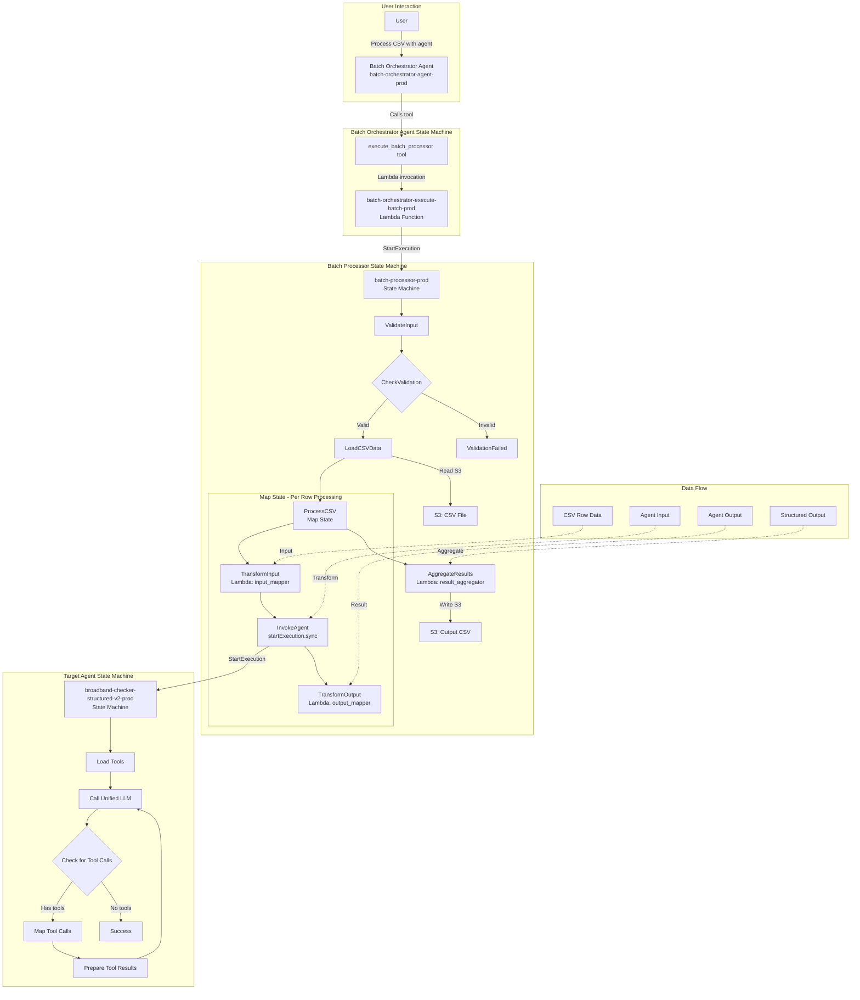

# Batch Processing Architecture

## Overview
The batch processing system consists of three main components working together to process CSV files through agents with structured output.

## Architecture Diagram



## Component Details

### 1. Batch Orchestrator Agent (`batch-orchestrator-agent-prod`)
**Purpose**: High-level orchestration interface for batch processing

**Tools**:
- `analyze_csv_structure` - Analyzes CSV file structure
- `validate_agent_compatibility` - Checks if agent supports structured output
- `execute_batch_processor` - Starts batch processing
- `monitor_batch_execution` - Monitors progress
- `get_batch_results` - Retrieves results

**Key Lambda**: `batch-orchestrator-execute-batch-prod`
- Validates configuration
- Starts batch processor state machine
- Returns execution ARN for monitoring

### 2. Batch Processor (`batch-processor-prod`)
**Purpose**: Core batch processing engine

**States**:
1. **ValidateInput**: Validates CSV and agent compatibility
2. **CheckValidation**: Routes based on validation result
3. **LoadCSVData**: Reads CSV from S3
4. **ProcessCSV (Map)**: Parallel processing of rows
   - **TransformInput**: Maps CSV columns to agent input
   - **InvokeAgent**: Executes target agent synchronously
   - **TransformOutput**: Extracts structured output
5. **AggregateResults**: Combines results into output CSV

**Lambda Functions**:
- `batch-processor-input-mapper-prod`: Transforms CSV data
- `batch-processor-output-mapper-prod`: Extracts structured output
- `batch-processor-result-aggregator-prod`: Creates final CSV

### 3. Target Agent (`broadband-checker-structured-v2-prod`)
**Purpose**: Processes individual data items with structured output

**Requirements**:
- Must have `structured_output.enabled: true` in registry
- Must implement `return_structured_data` tool
- Must handle input format: `{messages: [...], input: {...}}`

## Data Flow Example

### 1. Input CSV
```csv
address,postcode
"13 ALBION DRIVE, HACKNEY, LONDON","E8 4LX"
```

### 2. Batch Processor Configuration
```json
{
  "csv_s3_uri": "s3://bucket/input.csv",
  "target": {
    "type": "agent",
    "name": "broadband-checker-structured-v2"
  },
  "input_mapping": {
    "address": "address",
    "postcode": "postcode"
  },
  "output_mapping": {
    "structured_output_fields": [
      "exchange_station",
      "download_speed",
      "upload_speed",
      "screenshot_url"
    ]
  }
}
```

### 3. Agent Input (per row)
```json
{
  "messages": [
    {
      "role": "user",
      "content": "{\"address\": \"13 ALBION DRIVE, HACKNEY, LONDON\", \"postcode\": \"E8 4LX\"}"
    }
  ],
  "input": {
    "address": "13 ALBION DRIVE, HACKNEY, LONDON",
    "postcode": "E8 4LX"
  }
}
```

### 4. Agent Output (expected)
```json
{
  "messages": [...],
  "tool_results": [
    {
      "name": "return_structured_data",
      "content": {
        "exchange_station": "Hackney Central",
        "download_speed": 80,
        "upload_speed": 20,
        "screenshot_url": "https://..."
      }
    }
  ]
}
```

### 5. Output CSV
```csv
address,postcode,exchange_station,download_speed,upload_speed,screenshot_url,_status,_processing_time
"13 ALBION DRIVE, HACKNEY, LONDON","E8 4LX","Hackney Central",80,20,"https://...","SUCCESS",2.5
```

## Current Issues and Fixes

### Issue 1: Tools Field Not Propagating
**Problem**: The broadband-checker-structured-v2 agent fails with "JSONata expression '$states.input.tools' returned undefined"

**Root Cause**: The Load Tools state doesn't properly pass tools to the next state after we removed the Output override.

**Fix Required**: Update the Load Tools state to use Assign instead of Output:

```json
"Load Tools": {
  "Type": "Map",
  "Assign": {
    "tools": ""
  },
  "Next": "Call Unified LLM"
}
```


### Issue 2: Tool Use ID Mismatch
**Problem**: The monitor_batch_execution tool returns `tool_use_id: "1"` instead of the actual ID

**Root Cause**: The Rust LLM service or state machine is not preserving the original tool_use_id

**Workaround**: Lambda functions should handle missing/incorrect tool_use_ids gracefully

## Testing Strategy

### 1. Unit Tests

#### Test Input Mapper Lambda
```bash
# Test validation
aws lambda invoke --function-name batch-processor-input-mapper-prod \
  --payload '{
    "action": "validate",
    "csv_s3_uri": "s3://bucket/test.csv",
    "target": {"type": "agent", "name": "broadband-checker-structured-v2"},
    "output_mapping": {"structured_output_fields": ["field1"]}
  }' response.json

# Test CSV loading
aws lambda invoke --function-name batch-processor-input-mapper-prod \
  --payload '{
    "action": "load_csv",
    "csv_bucket": "bucket",
    "csv_key": "test.csv"
  }' response.json

# Test transformation
aws lambda invoke --function-name batch-processor-input-mapper-prod \
  --payload '{
    "action": "transform",
    "row": {"address": "123 Main St", "postcode": "ABC123"},
    "mapping_config": {},
    "target": {"type": "agent", "name": "test-agent"}
  }' response.json
```

#### Test Agent Compatibility
```bash
aws dynamodb get-item --table-name AgentRegistry-prod \
  --key '{"agent_name":{"S":"broadband-checker-structured-v2"},"version":{"S":"v2.0"}}' \
  --query "Item.structured_output"
```

### 2. Integration Tests

#### Test Batch Processor State Machine
```bash
# Direct state machine test
aws stepfunctions start-execution \
  --state-machine-arn arn:aws:states:us-west-2:672915487120:stateMachine:batch-processor-prod \
  --input '{
    "csv_s3_uri": "s3://batch-processor-results-prod-672915487120/test_addresses_short.csv",
    "target": {
      "type": "agent",
      "name": "broadband-checker-structured-v2"
    },
    "input_mapping": {
      "address": "address",
      "postcode": "postcode"
    },
    "output_mapping": {
      "structured_output_fields": ["exchange_station", "download_speed", "upload_speed", "screenshot_url"]
    }
  }'
```

#### Test Target Agent
```bash
# Test agent directly
aws stepfunctions start-execution \
  --state-machine-arn arn:aws:states:us-west-2:672915487120:stateMachine:broadband-checker-structured-v2-prod \
  --input '{
    "messages": [
      {"role": "user", "content": "Check broadband for 13 ALBION DRIVE, HACKNEY, LONDON, E8 4LX"}
    ]
  }'
```

### 3. End-to-End Tests

#### Via Orchestrator Agent
```bash
# Full flow test
aws stepfunctions start-execution \
  --state-machine-arn arn:aws:states:us-west-2:672915487120:stateMachine:batch-orchestrator-agent-prod \
  --input '{
    "messages": [
      {
        "role": "user",
        "content": "Process s3://batch-processor-results-prod-672915487120/test_addresses_short.csv using broadband-checker-structured-v2"
      }
    ]
  }'
```

### 4. Validation Checks

#### Permissions
- [ ] Batch processor can read input CSV from S3
- [ ] Batch processor can write output CSV to S3
- [ ] Batch processor can invoke target agent state machine
- [ ] Input/output mapper Lambdas can read from DynamoDB registries
- [ ] Result aggregator can read SSM parameter for bucket name

#### Data Flow
- [ ] CSV columns correctly mapped to agent input
- [ ] Agent receives properly formatted messages
- [ ] Structured output extracted from agent response
- [ ] Results aggregated with original data
- [ ] Metadata (_status, _processing_time) added

#### Error Handling
- [ ] Invalid CSV URI rejected
- [ ] Non-existent agent rejected
- [ ] Agent without structured output rejected
- [ ] Failed rows marked in output with error messages
- [ ] Partial failures don't stop entire batch

## Monitoring

### CloudWatch Metrics
- Execution success/failure rates
- Processing time per row
- Total rows processed
- Error types and frequencies

### CloudWatch Logs
- `/aws/stepfunctions/batch-processor-prod`
- `/aws/lambda/batch-processor-input-mapper-prod`
- `/aws/lambda/batch-processor-output-mapper-prod`
- `/aws/lambda/batch-processor-result-aggregator-prod`
- `/aws/stepfunctions/broadband-checker-structured-v2-prod`

### Step Functions Console
- Visual execution flow
- State input/output inspection
- Error details and retry information