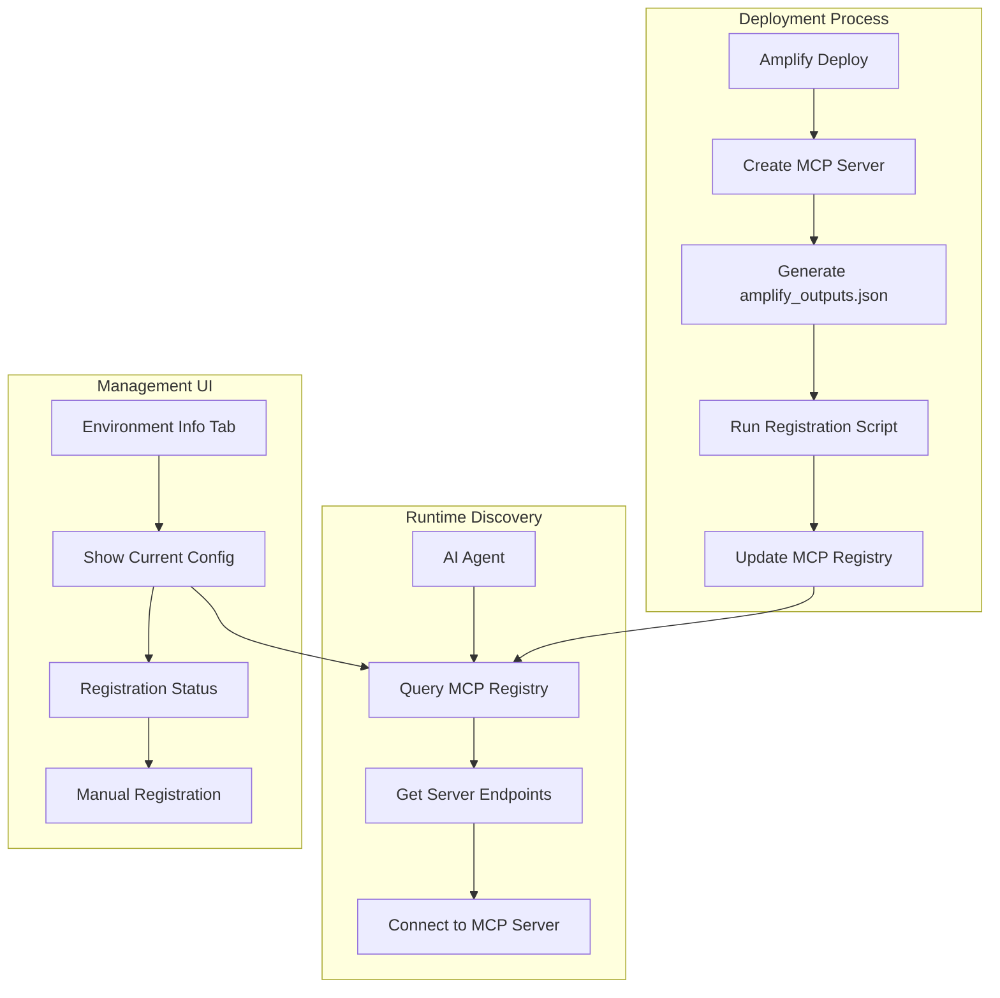

# MCP Registry Deployment Integration

## Overview

This document describes the complete solution for automatically populating the MCP Registry when deploying the Step Functions Agent Framework to different environments using Amplify.

## Problem Statement

When deploying to remote environments (dev, staging, prod), the MCP server resources (API Gateway endpoints, Lambda functions) are created dynamically by Amplify. These dynamically created resources need to be automatically registered in the MCP Registry so they can be discovered and used by AI agents.

## Solution Architecture

### 1. Components Overview



### 2. Implementation Components

#### A. Backend Infrastructure (CDK)
- **MCPRegistryStack**: DynamoDB table with GSIs for querying by status, protocol, and deployment stack
- **MCPGraphQLStack**: AppSync GraphQL API for querying and managing MCP servers
- **Seed Lambda**: Initial population of registry with known servers

#### B. GraphQL API Layer
- **Schema**: Comprehensive types for MCP servers, tools, and connection testing
- **Resolvers**: JavaScript resolvers compatible with AppSync runtime
- **Queries**: `listMCPServersFromRegistry`, `getMCPServer`, `testMCPServerConnection`

#### C. Automatic Registration System
- **Registration Script** (`register-mcp-server.js`): Reads `amplify_outputs.json` and registers MCP server
- **Deployment Hook** (`amplify.yml`): Automatically runs registration after backend deployment
- **Test Script** (`test-registration.js`): Validates registration logic without writing to DB

#### D. User Interface
- **MCP Servers Page**: Tabbed interface showing registered servers and environment info
- **Environment Info Component**: Shows current deployment details and registration status
- **Manual Registration**: UI option to register servers manually if needed

## Deployment Flow

### 1. Automatic Registration (Production)

```bash
# During Amplify deployment:
1. Backend resources are created (Lambda, API Gateway, etc.)
2. amplify_outputs.json is generated with dynamic endpoints
3. Registration script runs in postBuild phase
4. MCP server is automatically registered in registry
5. UI immediately shows the registered server
```

### 2. Local Development Registration

```bash
# For local development/testing:
cd ui_amplify/scripts
npm install
npm run test-registration  # Test without DB write
npm run register-mcp      # Actually register
```

## Configuration Details

### Environment-Aware Registration

The system automatically detects the environment and creates appropriate server IDs:

```javascript
// Server ID format: step-functions-agents-mcp-{environment}
prod -> step-functions-agents-mcp-prod
dev  -> step-functions-agents-mcp-dev
staging -> step-functions-agents-mcp-staging
```

### Registration Data Schema

Each registered MCP server includes:

```json
{
  "server_id": "step-functions-agents-mcp-prod",
  "version": "1.0.0",
  "server_name": "Step Functions Agents MCP Server (prod)",
  "description": "MCP server providing access to AWS Step Functions agents...",
  "endpoint_url": "https://abc123.execute-api.eu-west-1.amazonaws.com/mcp",
  "protocol_type": "jsonrpc",
  "authentication_type": "api_key",
  "available_tools": [
    {
      "name": "start_agent",
      "description": "Start execution of a Step Functions agent",
      "inputSchema": {...}
    },
    {
      "name": "get_execution_status", 
      "description": "Get status of an agent execution",
      "inputSchema": {...}
    },
    {
      "name": "list_available_agents",
      "description": "List all available agents from the registry",
      "inputSchema": {...}
    }
  ],
  "status": "active",
  "metadata": {
    "managed_by": "amplify",
    "environment": "prod",
    "deployment_method": "amplify",
    "aws_region": "eu-west-1",
    "tags": ["prod", "mcp", "step-functions"]
  }
}
```

## UI Integration

### Registry Tab
- Lists all registered MCP servers
- Shows server status, protocol, authentication
- Provides connection testing
- Expandable details with tool information

### Environment Info Tab
- Shows current environment's MCP server details from `amplify_outputs.json`
- Displays registration status
- Provides manual registration option
- Lists available tools and configuration

## Benefits

### 1. Zero-Configuration Discovery
- AI agents can automatically discover MCP servers in any environment
- No manual endpoint configuration required

### 2. Environment Isolation
- Each environment has its own registered servers
- Clear separation between dev, staging, and production

### 3. Deployment Automation
- MCP servers are automatically registered during deployment
- No manual intervention required

### 4. Operational Visibility
- UI shows all registered servers and their status
- Easy monitoring and management of MCP server endpoints

### 5. Testing & Validation
- Built-in connection testing for registered servers
- Comprehensive validation of registration data

## Security & Best Practices

### 1. Authentication
- API keys managed separately from registry
- IAM-based access control for registry operations

### 2. Environment Separation
- Different DynamoDB tables per environment (optional)
- Environment-specific server IDs prevent conflicts

### 3. Deployment Safety
- Validation of registration data before writing
- Rollback capability through CDK stack updates
- Comprehensive error handling and logging

## Monitoring & Troubleshooting

### Health Checking
- Automatic health check URL generation
- Connection testing through UI
- Status monitoring and alerts

### Logging & Debugging
- Comprehensive logging in registration scripts
- Test mode for validating registration logic
- Debug output for troubleshooting deployments

### Common Issues & Solutions

1. **Registration fails**: Check AWS permissions and region
2. **Endpoints not found**: Verify Amplify outputs generation
3. **Stale registrations**: Manual cleanup through UI or scripts

## Future Enhancements

- [ ] Multi-region deployment support
- [ ] Automatic deregistration on stack deletion  
- [ ] Health check validation before registration
- [ ] Blue/green deployment support
- [ ] Monitoring and alerting integration
- [ ] Tool discovery through Lambda introspection

## Summary

This comprehensive solution provides:
- **Automatic registration** of MCP servers during deployment
- **Environment-aware configuration** for different deployment stages
- **Zero-touch discovery** for AI agents
- **Operational visibility** through comprehensive UI
- **Production-ready** architecture with proper error handling and monitoring

The system ensures that MCP servers are always discoverable and properly registered, regardless of the deployment environment, enabling seamless AI agent interactions across the entire infrastructure.