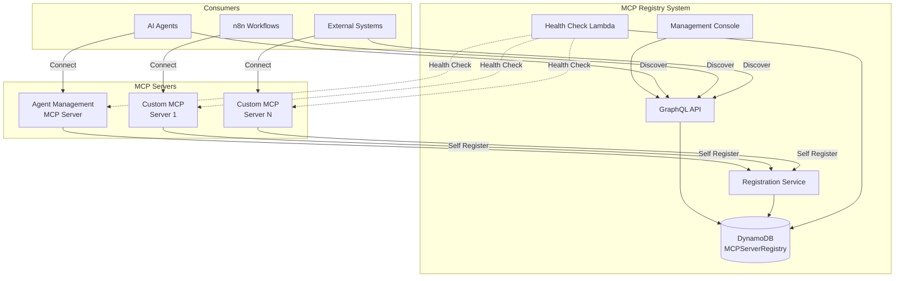
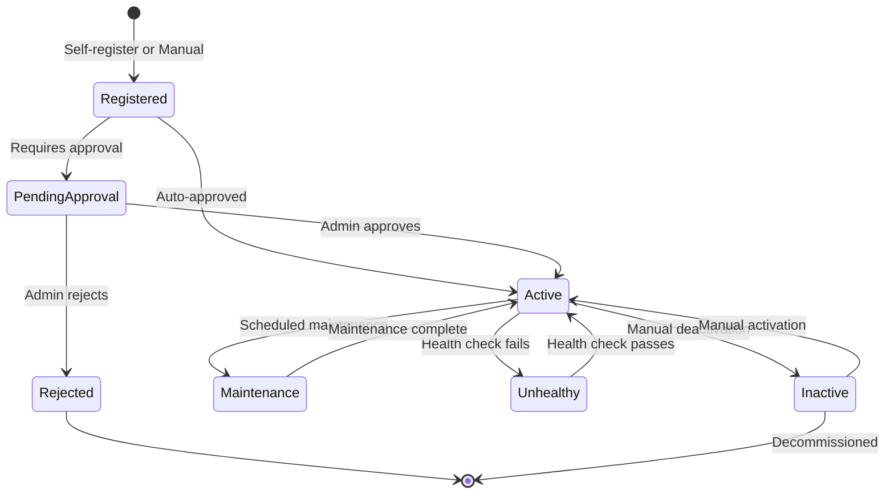
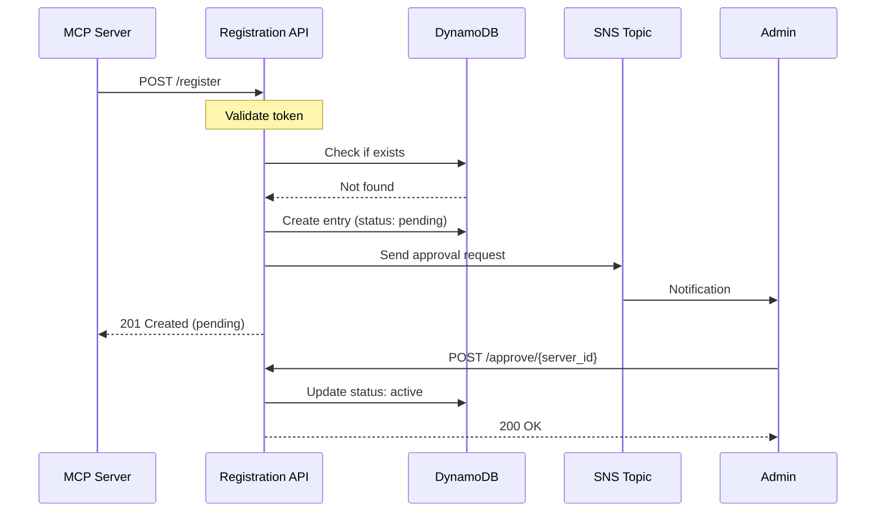

# MCP Registry Design Documentation

## Overview

The MCP (Model Context Protocol) Registry is a centralized system for registering, managing, and monitoring MCP servers within the Step Functions Agent Framework. It provides a unified interface for discovering and connecting to various MCP servers that extend the capabilities of AI agents.

## Architecture

### System Components



## Data Model

### DynamoDB Schema

**Table Name**: `MCPServerRegistry-{environment}`

| Attribute | Type | Description | Required |
|-----------|------|-------------|----------|
| `server_id` | String (PK) | Unique identifier for the MCP server | Yes |
| `version` | String (SK) | Server version (e.g., "1.0.0", "2.1.0") | Yes |
| `server_name` | String | Human-readable display name | Yes |
| `description` | String | Detailed description of server purpose | No |
| `endpoint_url` | String | Full URL to the MCP server endpoint | Yes |
| `protocol_type` | String | Protocol type: `jsonrpc`, `graphql`, `rest`, `websocket` | Yes |
| `authentication_type` | String | Auth method: `none`, `api_key`, `oauth`, `iam` | Yes |
| `api_key_header` | String | Header name for API key (if auth_type=api_key) | No |
| `available_tools` | List | Array of tool definitions (see below) | Yes |
| `status` | String | Server status: `active`, `inactive`, `maintenance`, `unhealthy` | Yes |
| `health_check_url` | String | Optional health check endpoint | No |
| `health_check_interval` | Number | Health check interval in seconds (default: 300) | No |
| `configuration` | Map | Server-specific configuration | No |
| `metadata` | Map | Additional metadata (tags, labels, etc.) | No |
| `deployment_stack` | String | CDK stack name that deployed this server | No |
| `deployment_region` | String | AWS region where server is deployed | No |
| `created_at` | String | ISO 8601 timestamp | Yes |
| `updated_at` | String | ISO 8601 timestamp | Yes |
| `created_by` | String | User/system that registered the server | No |

### Tool Definition Schema

Each tool in `available_tools` follows this structure:

```json
{
  "name": "tool_name",
  "description": "What this tool does",
  "inputSchema": {
    "type": "object",
    "properties": {
      "param1": {
        "type": "string",
        "description": "Parameter description"
      }
    },
    "required": ["param1"]
  },
  "outputSchema": {
    "type": "object",
    "properties": {
      "result": {
        "type": "string"
      }
    }
  }
}
```

### Global Secondary Indexes

1. **GSI-Status**: 
   - Partition Key: `status`
   - Sort Key: `updated_at`
   - Purpose: Query servers by status

2. **GSI-Protocol**: 
   - Partition Key: `protocol_type`
   - Sort Key: `server_name`
   - Purpose: Find servers by protocol type

3. **GSI-Stack**:
   - Partition Key: `deployment_stack`
   - Sort Key: `created_at`
   - Purpose: Track servers by CDK stack

## Authentication Types

### 1. None (`authentication_type: "none"`)
- No authentication required
- Server endpoint is publicly accessible
- Suitable for read-only or public data servers
- Example: Public documentation server, status pages

### 2. API Key (`authentication_type: "api_key"`)
- Requires API key in request headers
- Configurable header name (default: `x-api-key`)
- API keys managed separately (e.g., AWS Secrets Manager)
- Example: Most commercial APIs

### 3. OAuth 2.0 (`authentication_type: "oauth"`)
- Full OAuth 2.0 flow support
- Configuration includes:
  - Authorization URL
  - Token URL
  - Client ID/Secret storage location
  - Scopes required
- Example: GitHub, Google APIs

### 4. AWS IAM (`authentication_type: "iam"`)
- Uses AWS Signature Version 4 signing
- Requires IAM role/user with appropriate permissions
- Best for AWS-to-AWS communication
- Example: Internal AWS services

## Protocol Types

### 1. JSON-RPC (`protocol_type: "jsonrpc"`)
The standard MCP protocol using JSON-RPC 2.0:
```json
{
  "jsonrpc": "2.0",
  "method": "tools/call",
  "params": {
    "name": "tool_name",
    "arguments": {}
  },
  "id": 1
}
```

### 2. GraphQL (`protocol_type: "graphql"`)
GraphQL endpoint for query/mutation operations:
```graphql
query ListAgents {
  listAgentsFromRegistry {
    id
    name
    status
  }
}
```

### 3. REST (`protocol_type: "rest"`)
RESTful API endpoints:
```
GET /api/agents
POST /api/agents/{id}/execute
```

### 4. WebSocket (`protocol_type: "websocket"`)
For real-time bidirectional communication:
```
wss://server.example.com/ws
```

## Server States



## Health Check System

### Health Check Process

1. **Scheduled Check**: EventBridge rule triggers every 5 minutes
2. **Health Check Lambda**: Queries all active servers
3. **Protocol-Specific Checks**:
   - JSON-RPC: Send `{"jsonrpc":"2.0","method":"ping","id":1}`
   - GraphQL: Send introspection query `{ __typename }`
   - REST: Send GET to health endpoint
   - WebSocket: Establish connection and send ping

4. **Status Updates**:
   - 3 consecutive failures → Status: `unhealthy`
   - 1 success after unhealthy → Status: `active`
   - Response time > 5s → Warning metric

### Health Metrics

CloudWatch metrics published under namespace `MCPRegistry/Health`:

- `ServerHealth`: 1 for healthy, 0 for unhealthy
- `ResponseTime`: Response time in milliseconds
- `HealthCheckFailures`: Count of consecutive failures
- `ActiveServers`: Total count of active servers

## Self-Registration Process

### Registration Flow



### Registration Payload

```json
{
  "server_name": "My Custom MCP Server",
  "description": "Provides custom tools for X",
  "endpoint_url": "https://api.example.com/mcp",
  "protocol_type": "jsonrpc",
  "authentication_type": "api_key",
  "api_key_header": "x-api-key",
  "available_tools": [
    {
      "name": "custom_tool",
      "description": "Does something custom",
      "inputSchema": {
        "type": "object",
        "properties": {
          "input": {"type": "string"}
        },
        "required": ["input"]
      }
    }
  ],
  "health_check_url": "https://api.example.com/health",
  "metadata": {
    "owner": "team-name",
    "cost_center": "12345",
    "tags": ["production", "critical"]
  }
}
```

### Registration Security

1. **Registration Token**: Required in `x-registration-token` header
2. **Token Validation**: Checked against AWS Secrets Manager
3. **Rate Limiting**: Max 10 registration attempts per hour per IP
4. **Approval Workflow**: New registrations require admin approval
5. **Audit Trail**: All registrations logged in CloudWatch

## GraphQL API

### Queries

```graphql
type Query {
  # List all MCP servers
  listMCPServersFromRegistry: [MCPServer]
  
  # Get specific server details
  getMCPServer(server_id: String!, version: String): MCPServer
  
  # Find servers by status
  listMCPServersByStatus(status: String!): [MCPServer]
  
  # Find servers by protocol
  listMCPServersByProtocol(protocol_type: String!): [MCPServer]
  
  # Test server connection
  testMCPServerConnection(server_id: String!): ConnectionTestResult
}
```

### Mutations

```graphql
type Mutation {
  # Register new MCP server
  registerMCPServer(input: RegisterMCPServerInput!): RegisterMCPServerResult
  
  # Update server configuration
  updateMCPServer(
    server_id: String!
    version: String!
    input: UpdateMCPServerInput!
  ): UpdateResult
  
  # Update server status
  updateMCPServerStatus(
    server_id: String!
    version: String!
    status: String!
  ): StatusUpdateResult
  
  # Approve pending server
  approveMCPServer(server_id: String!): ApprovalResult
  
  # Decommission server
  decommissionMCPServer(server_id: String!, version: String!): DecommissionResult
}
```

### Types

```graphql
type MCPServer {
  server_id: String!
  version: String!
  server_name: String!
  description: String
  endpoint_url: String!
  protocol_type: String!
  authentication_type: String!
  available_tools: [Tool]
  status: String!
  health_check_url: String
  configuration: AWSJSON
  metadata: AWSJSON
  created_at: String!
  updated_at: String!
}

type Tool {
  name: String!
  description: String
  inputSchema: AWSJSON
  outputSchema: AWSJSON
}
```

## Security Considerations

### 1. Authentication & Authorization
- All GraphQL operations require Cognito authentication
- Registration requires valid registration token
- Admin operations require specific IAM permissions

### 2. Data Encryption
- DynamoDB encryption at rest (AWS managed keys)
- TLS 1.2+ for all API communications
- Sensitive configuration stored in Secrets Manager

### 3. Network Security
- MCP servers should be in private subnets when possible
- Use VPC endpoints for AWS service communication
- Implement IP allowlisting for critical servers

### 4. Audit & Compliance
- CloudTrail logging for all API calls
- X-Ray tracing for performance monitoring
- Regular security scanning of registered endpoints

## Monitoring & Observability

### CloudWatch Dashboards

1. **MCP Registry Overview**:
   - Total servers by status
   - Protocol type distribution
   - Recent registrations
   - Health check success rate

2. **Server Health Dashboard**:
   - Individual server health status
   - Response time trends
   - Error rates by server
   - Availability percentages

### Alarms

1. **Critical Alarms**:
   - Any server unhealthy > 15 minutes
   - Registration API errors > 10/minute
   - DynamoDB throttling

2. **Warning Alarms**:
   - Server response time > 3 seconds
   - Health check failures > 5%
   - Pending approvals > 48 hours

## Cost Optimization

### DynamoDB Optimization
- Use on-demand billing for variable workloads
- Implement item TTL for old versions
- Archive inactive servers to S3

### Lambda Optimization
- Use ARM64 architecture for better price/performance
- Right-size memory allocation based on metrics
- Implement connection pooling for health checks

### API Gateway Optimization
- Cache frequently accessed data (5-minute TTL)
- Use CloudFront for global distribution
- Implement request throttling

## Future Enhancements

### Phase 1 (Q1 2025)
- [ ] Basic registry with manual registration
- [ ] Health check system
- [ ] UI for viewing servers

### Phase 2 (Q2 2025)
- [ ] Self-registration API
- [ ] Approval workflow
- [ ] Advanced health metrics

### Phase 3 (Q3 2025)
- [ ] Auto-discovery within VPC
- [ ] Load balancing across servers
- [ ] Cost tracking per server

### Phase 4 (Q4 2025)
- [ ] Multi-region support
- [ ] Disaster recovery automation
- [ ] ML-based anomaly detection

## References

- [MCP Protocol Specification](https://github.com/anthropics/mcp)
- [Step Functions Agent Framework](../README.md)
- [Agent Registry Design](./AGENT_REGISTRY_DESIGN.md)
- [Tool Registry Design](./TOOL_REGISTRY_DESIGN.md)