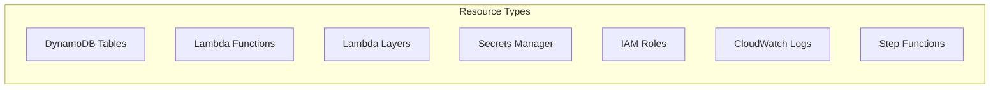
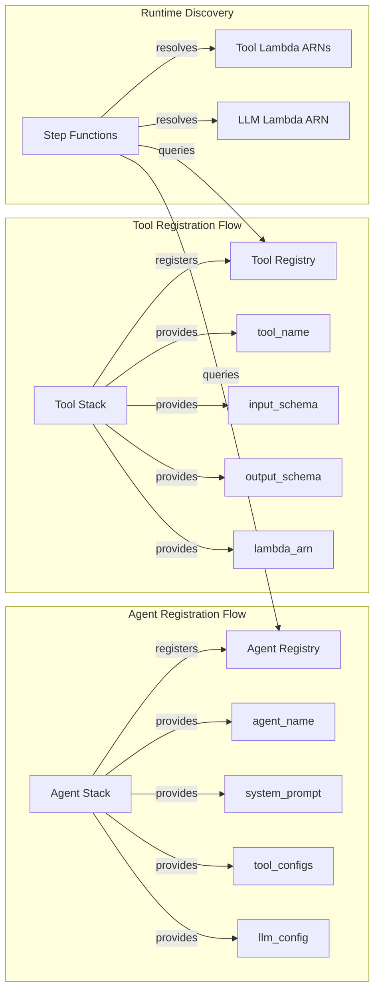
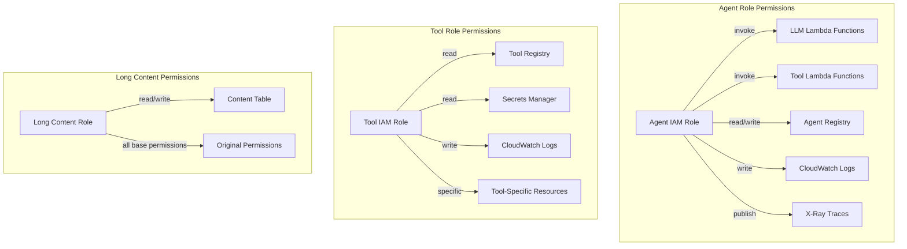
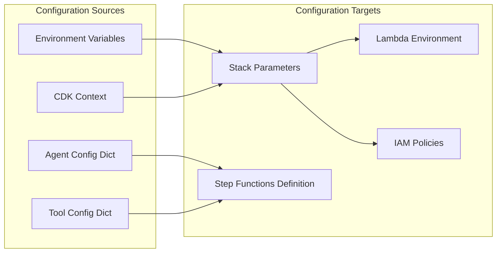
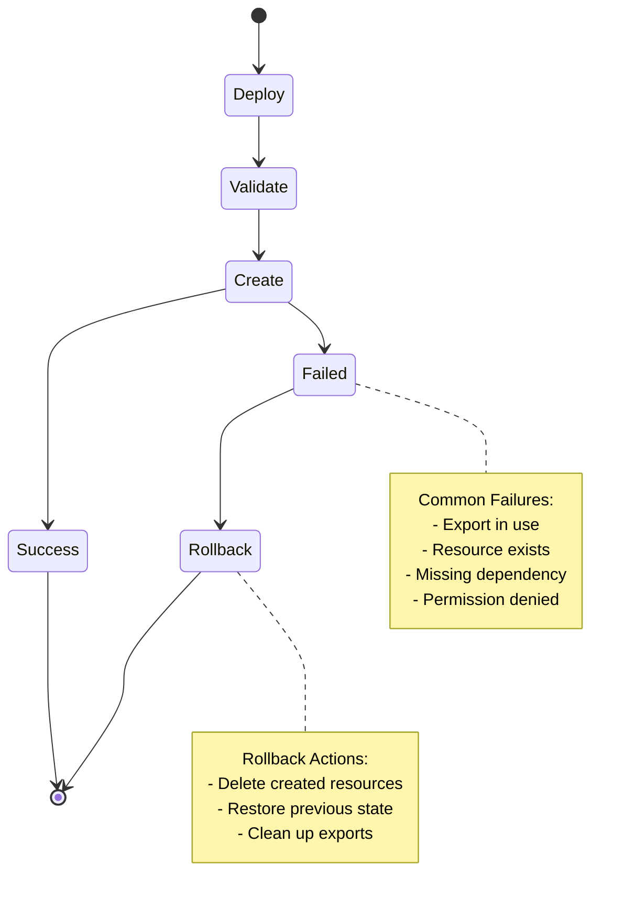

# Resource Flow and Integration Patterns

This document details how resources flow between stacks and the integration patterns used in the Step Functions Agent project.

## Resource Flow Overview



## Main Infrastructure Resource Flow

```mermaid
flowchart TB
    subgraph "Shared Resources Creation"
        A[SharedInfrastructureStack] -->|creates| A1[SharedLLMTable]
        B[AgentRegistryStack] -->|creates| B1[AgentRegistry Table]
        C[SharedLLMStack] -->|creates| C1[LLM Lambda Functions]
        C -->|creates| C2[LLM Secrets]
        C -->|creates| C3[LLM Layer]
        C -->|creates| C4[Log Group]
    end
    
    subgraph "Resource Exports"
        A1 -->|export TableName| EA1[SharedTableSharedLLMTable-{env}]
        A1 -->|export TableArn| EA2[SharedTableArnSharedLLMTable-{env}]
        B1 -->|export TableName| EB1[SharedTableAgentRegistry-{env}]
        B1 -->|export TableArn| EB2[SharedTableArnAgentRegistry-{env}]
        C1 -->|export ARNs| EC1[Shared{Provider}LambdaArn-{env}]
        C2 -->|export ARN| EC2[SharedLLMSecretArn-{env}]
        C3 -->|export ARN| EC3[SharedLLMLayerArn-{env}]
    end
    
    subgraph "Resource Consumers"
        D[Tool Stacks] -->|import| EA1
        D -->|import| EA2
        E[Agent Stacks] -->|import| EB1
        E -->|import| EB2
        E -->|import| EC1
        F[All Lambda Functions] -->|use| EC2
        F -->|use| EC3
    end
```

## Long Content Infrastructure Resource Flow

```mermaid
flowchart TB
    subgraph "Extension Layer Creation"
        A[LambdaExtensionLayerStack]
        A -->|builds with Makefile| A1[Rust Extension x86_64]
        A -->|builds with Makefile| A2[Rust Extension ARM64]
        A -->|creates| A3[Lambda Layer x86_64]
        A -->|creates| A4[Lambda Layer ARM64]
    end
    
    subgraph "Infrastructure Re-export"
        B[SharedLongContentInfrastructure]
        A3 -->|import| B
        A4 -->|import| B
        B -->|re-export| B1[SharedProxyLayerX86LongContent-{env}]
        B -->|re-export| B2[SharedProxyLayerArmLongContent-{env}]
        B -->|creates| B3[DynamoDB ContentTable]
        B3 -->|export| B4[SharedContentTableLongContent-{env}]
    end
    
    subgraph "Long Content Resources"
        C[LLM Functions]
        D[Tool Functions]
        B1 -->|layer added to| C
        B2 -->|layer added to| C
        B1 -->|layer added to| D
        B2 -->|layer added to| D
        B4 -->|permissions granted| C
        B4 -->|permissions granted| D
    end
    
    subgraph "Environment Variables"
        E[Lambda Environment]
        E -->|AWS_LAMBDA_EXEC_WRAPPER| E1[/opt/extensions/lrap-wrapper/wrapper]
        E -->|AGENT_CONTEXT_TABLE| B3
        E -->|MAX_CONTENT_SIZE| E2[Configurable Threshold]
    end
```

## Registry Integration Pattern



## Import/Export Patterns

### 1. Standard CloudFormation Export Pattern
```python
# Creating Export
CfnOutput(
    self,
    "AgentRegistryTableName",
    value=self.agent_registry_table.table_name,
    export_name=NamingConventions.stack_export_name(
        "Table", "AgentRegistry", self.env_name
    )
)

# Importing Export
self.agent_registry_table_name = Fn.import_value(
    NamingConventions.stack_export_name("Table", "AgentRegistry", self.env_name)
)
```

### 2. Direct Resource Import Pattern
```python
# Import by Table Name
self.agent_registry_table = dynamodb.Table.from_table_name(
    self,
    "ImportedAgentRegistry",
    "AgentRegistry-prod"
)

# Import by Lambda ARN
self.llm_function = lambda_.Function.from_function_arn(
    self,
    "ImportedLLM",
    "arn:aws:lambda:us-east-1:123456789:function:claude-llm-prod"
)

# Import by Secret Name
self.llm_secret = secretsmanager.Secret.from_secret_name_v2(
    self,
    "ImportedLLMSecrets",
    "/ai-agent/llm-secrets/prod"
)
```

### 3. Layer Import Pattern
```python
# Import Layer by ARN
proxy_extension_layer = lambda_.LayerVersion.from_layer_version_arn(
    self,
    "ProxyExtensionLayer",
    layer_version_arn=proxy_layer_arn
)

# Add to Lambda Function
lambda_function = lambda_.Function(
    self,
    "FunctionWithProxy",
    layers=[base_layer, proxy_extension_layer],
    environment={
        "AWS_LAMBDA_EXEC_WRAPPER": "/opt/extensions/lrap-wrapper/wrapper",
        "AGENT_CONTEXT_TABLE": content_table_name
    }
)
```

## Permission Flow



## Configuration Flow



## Error Handling and Rollback



## Best Practices

1. **Export Naming**: Use `NamingConventions.stack_export_name()` for consistency
2. **Import Safety**: Check if resource exists before importing
3. **Dependency Order**: Always declare explicit dependencies
4. **Resource Cleanup**: Use `RemovalPolicy.DESTROY` for development
5. **Permission Scope**: Grant minimal required permissions
6. **Error Messages**: Provide clear guidance for common errors