# Stack Dependency Diagrams

This document provides comprehensive dependency diagrams for all CDK applications in the Step Functions Agent project, showing stack relationships and shared resources.

## Table of Contents

1. [Refactored App (Self-Contained)](#refactored-app-self-contained)
2. [Long Content App (Extended)](#long-content-app-extended)
3. [Flexible Long Content App](#flexible-long-content-app)
4. [Standalone Long Content App](#standalone-long-content-app)
5. [Shared Resources Summary](#shared-resources-summary)

## Refactored App (Self-Contained)

The `refactored_app.py` creates a complete, self-contained Step Functions agent infrastructure.

```mermaid
graph TB
    subgraph "Shared Infrastructure Layer 🏗️"
        direction LR
        A[SharedInfrastructureStack<br/>🏭]
        A -->|creates| A2[🗃️ Tool Registry Table]
        A -->|exports| A1[📊 SharedLLMTable<br/>TableName & ARN]
        A -->|exports| A3[📋 ToolRegistry<br/>TableName & ARN]
        
        B[AgentRegistryStack<br/>📚]
        B -->|exports| B1[🗂️ AgentRegistry<br/>TableName & ARN]
        
        C[SharedLLMStack<br/>🤖]
        C -->|exports| C1[⚡ LLM Lambda ARNs<br/>Claude, OpenAI, Gemini<br/>Bedrock, DeepSeek]
        C -->|exports| C2[🔧 LLM Resources<br/>🔑 Secret, 📦 Layer, 📝 Logs]
    end
    
    subgraph "Agent Layer"
        direction TB
        K[GoogleMapsAgentStack<br/>🗺️ Location Services]
        K -->|uses| D1
        K -->|uses| B1
        K -->|uses| C1
        
        L[SqlAgentStack<br/>🗄️ Database Operations]
        L -->|uses| E1
        L -->|uses| B1
        L -->|uses| C1
        
        M[WebScraperAgentStack<br/>🕷️ Web Content]
        M -->|uses| F1
        M -->|uses| B1
        M -->|uses| C1
        
        N[ImageAnalysisAgentStack<br/>🖼️ Vision Analysis]
        N -->|uses| H1
        N -->|uses| B1
        N -->|uses| C1
        
        O[ResearchAgentStack<br/>🔍 Market Research]
        O -->|uses| I1
        O -->|uses| J1
        O -->|uses| B1
        O -->|uses| C1
        
        K -..- L
        L -..- M
        M -..- N
        N -..- O
    end
    
    subgraph "Tool Layer 🔧"
        direction TB
        D[GoogleMapsTools<br/>📍]
        E[DBInterfaceTools<br/>🗄️]
        F[WebAutomationTools<br/>🌐]
        G[CodeExecutionTools<br/>🐍]
        H[ImageAnalysisTools<br/>🖼️]
        I[ResearchTools<br/>🔍]
        J[FinancialTools<br/>💰]
        
        D1[📍 Maps APIs]
        E1[🗄️ SQL Tools]
        F1[🌐 Web Tools]
        G1[🐍 Python Exec]
        H1[🖼️ Vision Tools]
        I1[🔍 Research API]
        J1[💰 Finance APIs]
        
        D --> D1
        E --> E1
        F --> F1
        G --> G1
        H --> H1
        I --> I1
        J --> J1
        
        D -..- E
        E -..- F
        F -..- G
        G -..- H
        H -..- I
        I -..- J
        
        D --> A2
        E --> A2
        F --> A2
        G --> A2
        H --> A2
        I --> A2
        J --> A2
    end
    
    subgraph "Monitoring 📊"
        P[Dashboard<br/>📈]
        P -->|monitors| K
        P -->|monitors| L
        P -->|monitors| M
        P -->|monitors| N
        P -->|monitors| O
    end
    
    A --> D
    A --> E
    A --> F
    A --> G
    A --> H
    A --> I
    A --> J
    
    B --> K
    B --> L
    B --> M
    B --> N
    B --> O
    
    C --> K
    C --> L
    C --> M
    C --> N
    C --> O
```



### Key Resources in Refactored App:

1. **SharedInfrastructureStack**
   - DynamoDB SharedLLMTable (for LLM interactions)
   - Exports: Table name and ARN

2. **AgentRegistryStack**
   - DynamoDB AgentRegistry table
   - GSI: AgentsByStatus, AgentsByLLM, AgentsByEnvironment
   - Exports: Table name and ARN

3. **SharedLLMStack**
   - Lambda functions for each LLM provider
   - Secrets Manager secret for API keys
   - Lambda layer for shared dependencies
   - CloudWatch log group
   - Exports: All Lambda ARNs, Secret ARN, Layer ARN, Log Group ARN

4. **Tool Stacks**
   - Each creates tool-specific Lambda functions
   - Registers tools in Tool Registry
   - Exports Lambda function ARNs

5. **Agent Stacks**
   - Step Functions state machines
   - IAM roles with specific permissions
   - CloudWatch log groups
   - Registers in Agent Registry

## Long Content App (Extended)

The `long_content_app.py` extends the main infrastructure with long content support, importing existing resources.


### Key Resource Sharing in Long Content App:

1. **From Main Infrastructure (Imported)**
   - AgentRegistry table (via CloudFormation export)
   - Tool Registry table (via CloudFormation export)
   - LLM Secrets (via secret name import)

2. **New Resources Created**
   - Lambda Extension Layers (Rust proxy)
   - DynamoDB ContentTable for large content
   - New LLM Lambda functions with proxy support
   - New tool Lambda functions with proxy support

3. **Resource Flow**
   - Extension layers → Infrastructure → LLM/Tools → Agents
   - Each layer adds proxy support for content transformation

## Flexible Long Content App

The `flexible_long_content_app.py` provides configurable deployment options.

```mermaid
graph TD
    subgraph "Configuration Options ⚙️"
        CFG[Deployment Config<br/>🎛️]
        CFG -->|mode=standalone| MODE1[🆕 Create All Resources]
        CFG -->|mode=extend| MODE2[🔗 Import Existing Resources]
        CFG -->|mode=hybrid| MODE3[🔀 Mix Create/Import]
    end
    
    subgraph "Conditional Infrastructure 🏗️"
        A[FlexibleLongContentInfrastructure<br/>🔄]
        A -->|if create_proxy_layers| A1[🔨 Build Extension Layers]
        A -->|if import_proxy_layers| A2[📥 Import Layer ARNs]
        A -->|always creates| A3[🗄️ ContentTable]
        
        B[SharedLLMWithLongContent<br/>🤖]
        B -->|if create_llm| B1[🆕 New LLM Functions]
        B -->|if import_llm| B2[📥 Import LLM ARNs]
        B -->|if share_secrets| B3[🔑 Import Secrets]
        B -->|if create_secrets| B4[🆕 New Secrets]
    end
    
    subgraph "Flexible Agents 🤖"
        C[FlexibleLongContentAgent<br/>🎨]
        C -->|if use_agent_registry| C1[📥 Import Registry]
        C -->|if create_registry| C2[🆕 New Registry]
        C -->|configurable| C3[🔧 Tool Selection]
    end
```



## Standalone Long Content App

The `standalone_long_content_agent_stack.py` creates isolated long content agents.

```mermaid
graph TD
    subgraph "Standalone Stack 📦"
        A[StandaloneLongContentAgent<br/>🏃]
        A -->|creates| A1[👤 IAM Roles]
        A -->|creates| A2[📝 CloudWatch Logs]
        A -->|creates| A3[⚙️ Step Functions]
        A -->|creates| A4[✅ Approval Activity]
        A -->|no dependencies| A5[📦 Self-Contained]
    end
    
    subgraph "External Tools 🔧"
        B[Tool Lambda ARNs<br/>⚡]
        B -->|passed via config| A
    end
    
    subgraph "External LLM 🤖"
        C[LLM Lambda ARN<br/>⚡]
        C -->|passed via config| A
    end
```



## Shared Resources Summary

### CloudFormation Exports

| Stack | Export Name Pattern | Resource | Used By |
|-------|-------------------|----------|----------|
| AgentRegistryStack | SharedTableAgentRegistry-{env} | Table Name | All Agents |
| AgentRegistryStack | SharedTableArnAgentRegistry-{env} | Table ARN | All Agents |
| SharedLLMStack | Shared{Provider}LambdaArn-{env} | LLM Lambda ARNs | All Agents |
| Tool Stacks | {ToolName}LambdaArn-{env} | Tool Lambda ARNs | Specific Agents |
| LambdaExtensionLayer | SharedProxyLayer{Arch}ExtensionBuild-{env} | Layer ARNs | Long Content Infra |
| SharedLongContentInfra | SharedProxyLayer{Arch}LongContent-{env} | Layer ARNs | Long Content Stacks |
| SharedLongContentInfra | SharedContentTableLongContent-{env} | Table Name | Long Content Stacks |

### Import Patterns

1. **By Export Name**

   ```python
   Fn.import_value("SharedTableAgentRegistry-prod")
   ```

2. **By Table Name**

   ```python
   dynamodb.Table.from_table_name(self, "ImportedTable", "AgentRegistry-prod")
   ```

3. **By ARN**

   ```python
   lambda_.Function.from_function_arn(self, "ImportedLLM", "arn:aws:lambda:...")
   ```

4. **By Secret Name**

   ```python
   secretsmanager.Secret.from_secret_name_v2(self, "ImportedSecret", "/ai-agent/llm-secrets/prod")
   ```

## Deployment Order

### Refactored App (Self-Contained)

1. SharedInfrastructureStack
2. AgentRegistryStack
3. SharedLLMStack
4. All Tool Stacks (parallel)
5. All Agent Stacks (parallel)
6. MonitoringDashboardStack

### Long Content App (Extended)

1. Ensure main infrastructure is deployed
2. LambdaExtensionLayerStack
3. SharedLongContentInfrastructureStack
4. SharedLLMWithLongContentStack
5. Tool Stacks with Long Content (parallel)
6. Agent Stacks with Long Content (parallel)

### Key Design Principles

1. **Dependency Direction**: Infrastructure → Tools/LLM → Agents → Monitoring
2. **Resource Sharing**: Via CloudFormation exports or direct imports
3. **Flexibility**: Support for standalone, extended, and hybrid deployments
4. **Isolation**: Each stack manages its own resources
5. **Reusability**: Common patterns extracted to base constructs
