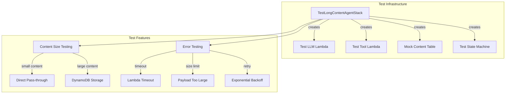
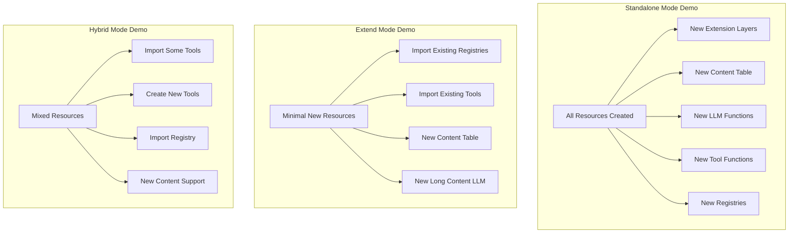
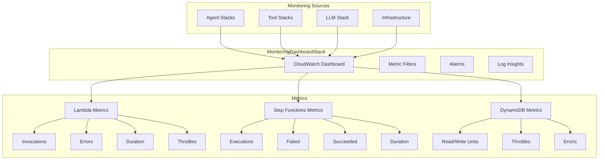
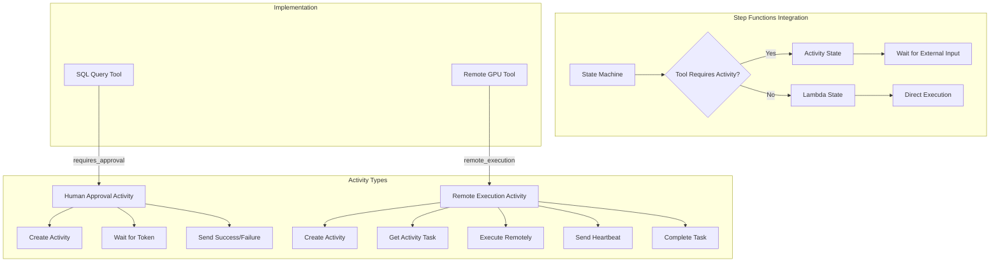
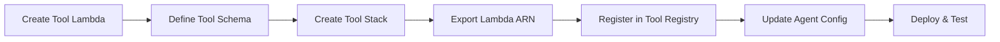
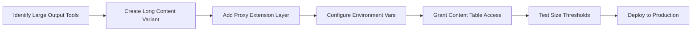
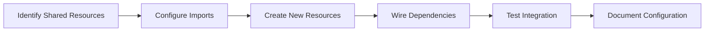

# Test and Demo Application Diagrams

This document shows the dependency structure of test and demo CDK applications created for specific features.

## Test Long Content Agent Stack

Located in `stacks/agents/test_long_content_agent_stack.py`



## Test Extended Long Content Agent Stack

Shows mixed resource usage patterns:

```mermaid
graph TD
    subgraph "Mixed Resources Example"
        A[TestExtendedLongContentAgent]
        A -->|imports| B[Existing Agent Registry]
        A -->|imports| C[Existing Web Scraper Tool]
        A -->|creates| D[New SQL Tool with Long Content]
        A -->|imports| E[Existing LLM Function]
        A -->|creates| F[New State Machine]
    end
    
    subgraph "Configuration"
        G[agent_config]
        G --> G1[use_agent_registry: true]
        G --> G2[import_tools: ['web_scraper']]
        G --> G3[create_tools: ['sql_executor']]
        G --> G4[llm_arn: 'arn:aws:lambda:...']
    end
    
    G --> A
```

## Flexible Long Content Demo

Shows all three deployment modes:



## Web Automation Tool Stack (Example)

Shows complete tool deployment pattern:

```mermaid
graph TD
    subgraph "Tool Stack Structure"
        A[WebAutomationToolStack]
        A -->|creates| B[Web Scraper Lambda]
        A -->|creates| C[HTML Parser Lambda]
        A -->|creates| D[Screenshot Lambda]
        A -->|creates| E[Web Scraper Memory Lambda]
    end
    
    subgraph "Tool Registration"
        F[Tool Registry]
        B -->|registers| F
        C -->|registers| F
        D -->|registers| F
        E -->|registers| F
    end
    
    subgraph "Exports"
        B -->|export| G[WebScraperLambdaArn-{env}]
        C -->|export| H[HtmlParserLambdaArn-{env}]
        D -->|export| I[ScreenshotLambdaArn-{env}]
        E -->|export| J[WebScraperMemoryLambdaArn-{env}]
    end
    
    subgraph "Permissions"
        K[Lambda Roles]
        K --> K1[Basic Execution]
        K --> K2[X-Ray Tracing]
        K --> K3[Secrets Access]
        K --> K4[Tool-Specific]
    end
```

## Monitoring Dashboard Stack (Example)

Shows cross-stack monitoring integration:



## Activity Support Demo

Shows human approval and remote execution patterns:



## Development Workflow Examples

### 1. Adding a New Tool


### 2. Adding Long Content Support


### 3. Creating Hybrid Deployment


## Common Patterns

### Tool Factory Pattern
```python
# Base pattern for creating multiple similar tools
class ToolFactory:
    def create_tool(tool_name, schema) -> Lambda:
        return Lambda(
            function_name=f"tool-{tool_name}-{env}",
            handler="index.handler",
            runtime=PYTHON_3_11,
            environment={"TOOL_NAME": tool_name}
        )
```

### Agent Builder Pattern
```python
# Pattern for building agents with configurable tools
class AgentBuilder:
    def with_tools(tool_arns) -> Agent:
        return Agent(
            tool_configs=[
                {"tool_name": name, "lambda_arn": arn}
                for name, arn in tool_arns.items()
            ]
        )
```

### Resource Import Pattern
```python
# Pattern for conditional resource import/create
class ResourceManager:
    def get_resource(config):
        if config.get("import_from"):
            return import_resource(config["import_from"])
        else:
            return create_resource(config)
```