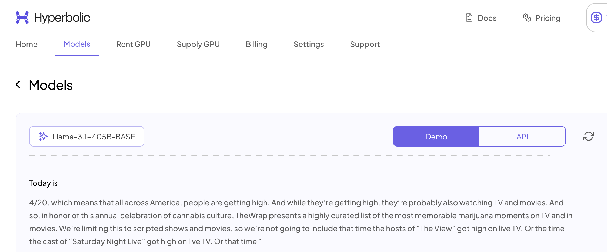

# Understanding LLM

## Next Token Prediction

Large Language Models (LLM) are trained to predict the next token in a sequence. This is done by training the model on a large corpus of text, and then using the model to predict the next token in a sequence. The model is trained to minimize the loss function, which is the difference between the predicted token and the actual token.

For example, let's check the [Hyperbolic](https://app.hyperbolic.xyz/models/llama31-405b-base-bf-16) website, and choose one of the base models (e.g. `llama31-405b-base-bf-16`). If we provide the model with the following input:

```plaintext
Today is
```

The model will predict the next token in the sequence. In this case, the model will predict one of the days (day of the week or calendar day) that it encountered during training. For example, the model might predict:

```plaintext
Today is

4/20, which means that all across America, people are getting high. And while they’re getting high, ...
```



This is a very simple example, but it illustrates the basic idea of next token prediction. We gave it very few tokens, and it predicted the next tokens in the sequence. Let's try another example and give it now more tokens:

```plaintext
The days of the week are important to provide order for many human activities. 
Therefore, each person knows that if yesterday was Monday, today is
```

The model will predict the next token in the sequence, and most likely it will predict:

```plaintext
The days of the week are important to provide order for many human activities. 
Therefore, each person knows that if yesterday was Monday, today is

Tuesday. 
```

It is important to note that the model is not aware of the current date, and it only answer based on its knowledge of the training data. If we want to know the current day, we should provide the model with a method to access the current date.

## Additional LLM Limitations

The above example is a simple illustration of how LLMs work, and what are the limitations of these models. There are a few more important limitations that we need to consider:

* **Cutoff Date**: The model is trained on data up to a certain date, and it does not have knowledge of events that occurred after that date. It we want to know what is the current weather, or the results of the last football match, we need to provide the model with a method to access this information.

* **Access to Internal Knowledge**: The model was not trained on internal documents of organizations, and it does not have access to internal knowledge, such as the inventory levels of a company or the orders of a customer. If we want the model to participate in a conversation with a customer, we need to provide the model with a method to access this information.

* **Exact Computation**: The model does not perform exact computations, and it can only provide approximate **statistical** tokens predictions. Even simple tasks such as counting the number of "r"s in the word "strawberry" can be challenging for the model. See the following example:

<div style={{ textAlign: "center" }}>
  
</div>

To overcome these limitations, we need to build AI agents that can interact with the model and provide it with the necessary information. These agents can be built using a variety of technologies, such as APIs, databases, and web scraping tools. The agents can also be trained on specific tasks, such as customer service or data analysis, to improve their performance.
