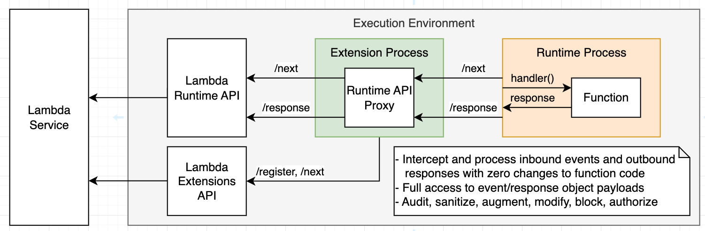
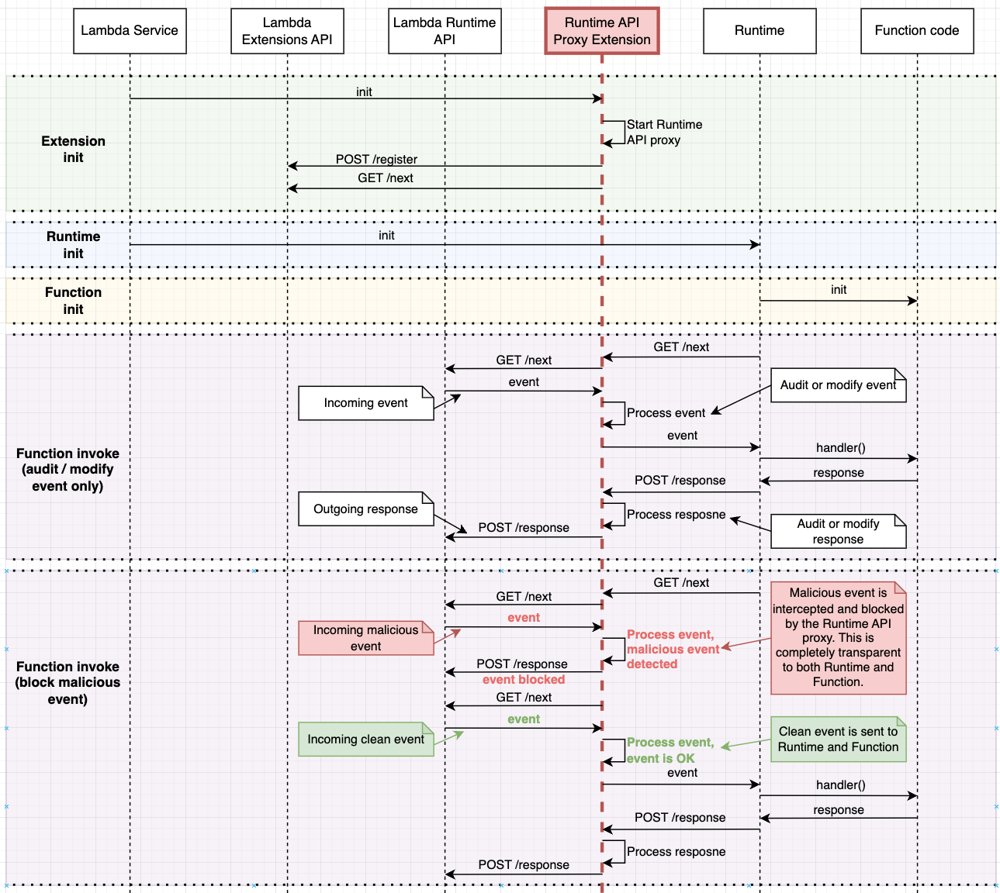

# Lambda Runtime API Proxy Extension - Rust

This repo contains an implementation of Lambda Runtime API Proxy extension with Rust 🦀.

> This implementation is used to overcome the limitation of AWS Step Functions on the size of the text that can be passed between the steps. For some tools, list the web scrapper or image processing, the output can be very large and can't be passed between the steps. This extension will intercept the response from the Lambda function and store it in DynamoDB if the size is larger than the specified limit. The extension also intercepts the request to the Lambda function that includes such reference and replace the reference with the actual content from DynamoDB.
>
> The proxy implementation is based on the blog post describing this pattern [here](https://aws.amazon.com/blogs/compute/enhancing-runtime-security-and-governance-with-the-aws-lambda-runtime-api-proxy-extension/)

The design of the the extension allows to a simple modification of the transformation logic that is applied to the content. The extension is implemented in Rust and can be easily compiled to the Lambda compatible binary. The transformation logic is implemented in the `transform` module in the `src/transform.rs` file. The transformation logic is applied to the content that is larger than the specified limit.

## Architecture

Lambda Runtimes use the `AWS_LAMBDA_RUNTIME_API` environment variable for making requests to the Runtime API. Two primary endpoints for the happy path scenario are `/next`, which is used to retrieve the next event to process, and `/response`, which is used to return event processing results to the Lambda service. In addition, the Lambda Runtime API also provides endpoints for reporting failures. See the full protocol and schema definitions of the Runtime API [here](https://docs.aws.amazon.com/lambda/latest/dg/runtimes-api.html).

The Runtime API Proxy is a component that hooks into the default workflow, and proxies requests and responses, allowing you to augment them and control the workflow along the path. This is illustrated in the following diagram.



## Sequence diagram

When Lambda service creates a new Execution Environment, it starts by initializing extensions attached to the function. The Execution Environment waits for all extensions to register by calling the Extensions API `/register` endpoint, and only then proceeds to initialize the Runtime. This allows you to start the Runtime API Proxy HTTP listener during extension initialization so it will be ready to serve Runtime requests.

By default, the value of `AWS_LAMBDA_RUNTIME_API` environment variable in the Runtime process points to the Lambda Runtime API endpoint 127.0.0.1:9001. You can use a simple wrapper script to change that value to point to the Runtime API Proxy endpoint instead. You can add a wrapper script to your function by setting the `AWS_LAMBDA_EXEC_WRAPPER` environment variable. The following wrapper script assumes that the Runtime API Proxy is listening on port 9009.

```bash
#!/bin/bash
args=("$@")
export AWS_LAMBDA_RUNTIME_API="127.0.0.1:9009"
exec "${args[@]}"
```

You can either add the above export line to the existing wrapper script or create a new one. Read more about using wrapper scripts [Lambda runtime wrapper documentation](https://docs.aws.amazon.com/lambda/latest/dg/runtimes-modify.html#runtime-wrapper).

After following the above steps, the Runtime API Proxy will be bootstrapped by the Lambda service when a new Execution Environment is created and will be ready to proxy requests from the Runtime to Runtime API by the first invocation. The only thing left to do is to implement the proxy logic.



## Considerations

The proxy extension is implemented in Rust and can be easily compiled to the Lambda compatible binary, both for X86 and Arm architectures. Since the extension is a separate process, it can be used by any Lambda function regardless of the runtime. As the AI Agent framework allows the development of tools in any language, the extension can be used by any tool developed in the framework in any programming language (TypeScript, Java, Rust, Python, etc.).

## 🏗️ Building and Deploying the Extension

This project uses a Makefile for building and deploying the Lambda Runtime API Proxy extension.

### Dependencies

* Make tools
* [Rust standard](https://www.rust-lang.org/tools/install)
* Cargo Lambda: `cargo install cargo-lambda`
* AWS SAM CLI
* AWS CLI configured with appropriate permissions to deploy Lambda functions
* `zip` tool
* `jq` JSON manipulation tool (for testing)

### Building and Deploying

The project provides a simple Makefile interface for all build and deployment operations:

#### 1. View Available Commands

```bash
make help
```

This displays all available commands and options.

#### 2. Build the Extension

```bash
make build
# or
make build-arm
make build-x86
```

This will:

* Build the Rust extension for x86_64 and ARM64 architectures
* Create the proper directory structure
* Package the extension into a ZIP file
* Generate a test function ZIP file

#### 3. Deploy the Extension

```bash
make deploy
# or
make deploy-arm
make deploy-x86
```

This command:

* Builds the extension if needed
* Creates a CloudFormation stack with the extension and test function
* Deploys using AWS SAM CLI

#### 4. Test the Deployed Function

```bash
make test
# or
make test-arm
make test-x86
```

This will:

* Invoke the Lambda function
* Display the response
* Show the CloudWatch logs

### Using the Extension with an Existing Lambda Function

To add this extension to an existing Lambda function:

1. Deploy the extension layer using `make deploy`
2. Get the Layer ARN from the CloudFormation stack outputs:

   ```bash
   aws cloudformation describe-stacks \
       --stack-name lambda-runtime-api-proxy \
       --query "Stacks[0].Outputs[?OutputKey=='ProxyExtensionLayerArn'].OutputValue" \
       --output text
   ```

3. Update your Lambda Function configuration:

   ```bash
   aws lambda update-function-configuration \
       --function-name YOUR_FUNCTION_NAME \
       --layers LAYER_ARN \
       --environment Variables={AWS_LAMBDA_EXEC_WRAPPER=/opt/extensions/lrap-wrapper/wrapper}
   ```

4. Invoke your function to test the proxy functionality

**IMPORTANT:** Always remember to set the `AWS_LAMBDA_EXEC_WRAPPER=/opt/extensions/lrap-wrapper/wrapper` environment variable in your Lambda function configuration. This path must match exactly for the proxy to work properly.

### Adding the Extension to a Python CDK Stack

Here's how to add the Lambda Runtime API Proxy extension to your Lambda functions in a Python-based CDK stack:

```python
import os
from aws_cdk import (
    Stack,
    aws_lambda as lambda_,
    aws_dynamodb as dynamodb,
    Duration,
    RemovalPolicy
)
from constructs import Construct

class YourCdkStack(Stack):
    def __init__(self, scope: Construct, construct_id: str, **kwargs) -> None:
        super().__init__(scope, construct_id, **kwargs)
        
        # Create DynamoDB table for storing large content (if needed)
        agent_context_table = dynamodb.Table(
            self, "AgentContextTable",
            table_name="AgentContext",
            partition_key=dynamodb.Attribute(
                name="id",
                type=dynamodb.AttributeType.STRING
            ),
            billing_mode=dynamodb.BillingMode.PAY_PER_REQUEST,
            removal_policy=RemovalPolicy.DESTROY,  # Change for production
        )
        
        # Reference the Lambda Runtime API Proxy layer
        # Use the appropriate ARN for your architecture (x86 or ARM)
        proxy_extension_layer = lambda_.LayerVersion.from_layer_version_arn(
            self, "ProxyExtensionLayer",
            # Replace with your deployed layer ARN:
            layer_version_arn=f"arn:aws:lambda:{self.region}:{self.account}:layer:lambda-runtime-api-proxy-x86-dev:1"
        )
        
        # Create your Lambda function with the extension layer
        your_function = lambda_.Function(
            self, "YourFunction",
            runtime=lambda_.Runtime.PYTHON_3_11,  # Use any supported runtime
            code=lambda_.Code.from_asset("path/to/your/code"),
            handler="app.handler",
            environment={
                # Required for Lambda Runtime API Proxy to work
                "AWS_LAMBDA_EXEC_WRAPPER": "/opt/extensions/lrap-wrapper/wrapper",
                
                # Configuration for content transformation
                "AGENT_CONTEXT_TABLE": agent_context_table.table_name,
                "MAX_CONTENT_SIZE": "5000",  # Maximum size before storing in DynamoDB
                
                # For debugging (optional)
                "LRAP_DEBUG": "true",
            },
            layers=[
                proxy_extension_layer
            ],
            timeout=Duration.seconds(30),
        )
        
        # Grant the Lambda function permission to access the DynamoDB table
        agent_context_table.grant_read_write_data(your_function)
```

#### Key Environment Variables

| Variable Name | Required | Description |
|---------------|----------|-------------|
| `AWS_LAMBDA_EXEC_WRAPPER` | Yes | Must be set to `/opt/extensions/lrap-wrapper/wrapper` |
| `AGENT_CONTEXT_TABLE` | No | DynamoDB table name for storing large content (default: `AgentContext`) |
| `MAX_CONTENT_SIZE` | No | Maximum content size in bytes before storing in DynamoDB (default: `50`) |
| `LRAP_DEBUG` | No | Set to `true` to enable detailed debug logging |
| `LRAP_LISTENER_PORT` | No | Custom port for the proxy to listen on (default: `9009`) |

#### Debugging Markers

When the Lambda Runtime API Proxy extension processes events and responses, it adds debug markers:

* `proxy_in: true` - Added to input events processed by the proxy
* `proxy_out: true` - Added to responses processed by the proxy

These markers can help you verify that the proxy is correctly processing your function's events and responses.

## CI/CD Pipeline

This project includes an automated CI/CD pipeline using AWS CodeBuild that builds the extensions for both ARM64 and x86_64 architectures.

### Architecture

The CI/CD pipeline uses AWS CodeBuild to automatically build the extensions whenever code is pushed to the repository. The process works as follows:

1. CodeBuild is configured with a webhook to the GitHub repository
2. When code is pushed, CodeBuild pulls the latest code
3. CodeBuild runs the build process defined in `buildspec.yml`
4. The built extension ZIPs are stored in an S3 bucket with a region and account-specific name
5. The extensions can then be deployed as Lambda layers

### AWS CodeBuild Setup

The CodeBuild project has already been created:
```
arn:aws:codebuild:us-west-2:672915487120:project/step-functions-agent
```

To configure the webhook connection to GitHub:

1. Open the AWS CodeBuild console
2. Select the project "step-functions-agent"
3. Choose "Edit" > "Source"
4. Under "Source provider", select "GitHub"
5. Connect to your GitHub account if not already connected
6. Select the repository
7. Under "Webhook", choose "Rebuild every time a code change is pushed to this repository"
8. Optional: Add filters to only trigger on changes to the `lambda/extensions/long-content` directory

### CodeBuild Service Role Permissions

The CodeBuild service role needs these permissions:

- `s3:PutObject` and `s3:CreateBucket` for storing build artifacts
- `logs:CreateLogGroup`, `logs:CreateLogStream`, `logs:PutLogEvents` for logging
- `sts:GetCallerIdentity` to determine the account ID

### Build Process

The build process is defined in `buildspec.yml` and includes:

1. Installing required dependencies (Rust, cargo-lambda, AWS SAM CLI)
2. Building the extensions for both architectures using the Makefile
3. Storing the built extensions in an S3 bucket with name pattern:
   ```
   step-functions-agent-artifacts-{region}-{account-id}
   ```

### Using the Built Extensions

After a successful build, the extension layer ZIPs are available at:
```
s3://step-functions-agent-artifacts-{region}-{account-id}/lambda-layers/extension-arm.zip
s3://step-functions-agent-artifacts-{region}-{account-id}/lambda-layers/extension-x86.zip
```

You can use these ZIPs to create Lambda layers using the AWS CLI:
```bash
# For ARM64
aws lambda publish-layer-version \
  --layer-name lambda-runtime-api-proxy-arm \
  --description "Lambda Runtime API Proxy Extension for ARM64" \
  --license-info "MIT" \
  --content S3Bucket=step-functions-agent-artifacts-{region}-{account-id},S3Key=lambda-layers/extension-arm.zip \
  --compatible-runtimes provided provided.al2 nodejs14.x nodejs16.x nodejs18.x python3.9 python3.10 python3.11 java11 java17 \
  --compatible-architectures arm64

# For x86_64
aws lambda publish-layer-version \
  --layer-name lambda-runtime-api-proxy-x86 \
  --description "Lambda Runtime API Proxy Extension for x86_64" \
  --license-info "MIT" \
  --content S3Bucket=step-functions-agent-artifacts-{region}-{account-id},S3Key=lambda-layers/extension-x86.zip \
  --compatible-runtimes provided provided.al2 nodejs14.x nodejs16.x nodejs18.x python3.9 python3.10 python3.11 java11 java17 \
  --compatible-architectures x86_64
```

## Useful links

* [AWS Lambda Extension API docs](https://docs.aws.amazon.com/lambda/latest/dg/runtimes-extensions-api.html)
* [Introducing Lambda Extensions blog](https://aws.amazon.com/blogs/compute/introducing-aws-lambda-extensions-in-preview/)
* [AWS Lambda Extensions GA blog](https://aws.amazon.com/blogs/aws/getting-started-with-using-your-favorite-operational-tools-on-aws-lambda-extensions-are-now-generally-available/)
* [Lambda Extensions Deep-Dive video series](https://www.youtube.com/playlist?list=PLJo-rJlep0ECO8od7NRdfJ4OrnQ7TMAwj)
* [AWS Lambda Extensions GitHub.com samples](https://github.com/aws-samples/aws-lambda-extensions)
