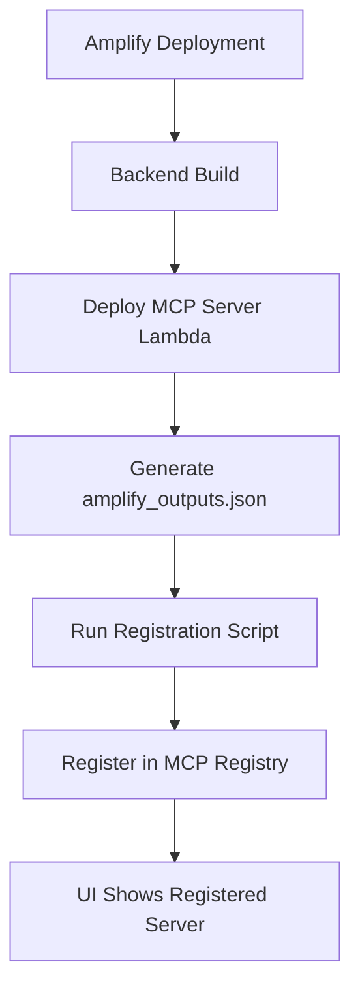

# MCP Server Automatic Registration

This directory contains scripts and configuration for automatically registering MCP servers in the registry during Amplify deployments.

## Overview

When deploying the Step Functions Agent Framework with Amplify, the MCP server resources (API Gateway, Lambda functions, etc.) are created dynamically. This system automatically registers these resources in the MCP Registry so they can be discovered and used by AI agents.

## How It Works

### 1. Deployment Flow



### 2. Components

#### amplify_outputs.json
This file is generated by Amplify during deployment and contains:
- MCP server endpoint URL
- AWS region
- Lambda function names
- Log group names
- Other deployment artifacts

Example structure:
```json
{
  "data": {
    "aws_region": "eu-west-1"
  },
  "custom": {
    "mcpServerEndpoint": "https://abc123.execute-api.eu-west-1.amazonaws.com/mcp",
    "functions": {
      "mcpServer": "step-functions-agents-prod-mcp-server"
    },
    "logGroups": {
      "mcpServer": "/aws/lambda/step-functions-agents-prod-mcp-server"
    }
  }
}
```

#### Registration Script (`register-mcp-server.js`)
- Reads `amplify_outputs.json`
- Extracts MCP server information
- Creates registration data with proper schema
- Registers server in DynamoDB MCP Registry

#### UI Environment Info (`MCPEnvironmentInfo.tsx`)
- Shows current environment's MCP server details
- Displays registration status
- Provides manual registration option
- Lists available tools and configuration

## Usage

### Automatic Registration (Recommended)

The registration happens automatically during Amplify deployment via the `amplify.yml` configuration:

```yaml
backend:
  phases:
    postBuild:
      commands:
        - cd scripts && npm install --production
        - npm run register-mcp
```

### Manual Registration

You can also run the registration manually:

```bash
# From the ui_amplify/scripts directory
npm install
npm run register-mcp
```

### Testing

Test the registration logic without writing to DynamoDB:

```bash
npm run test-registration
```

## Configuration

### Environment Detection
The script automatically detects the environment from:
1. `NODE_ENV` environment variable
2. Amplify branch name
3. Defaults to 'development'

### Server ID Generation
Server IDs are generated as: `step-functions-agents-mcp-{environment}`

Examples:
- `step-functions-agents-mcp-prod`
- `step-functions-agents-mcp-dev` 
- `step-functions-agents-mcp-staging`

### Registration Data Schema

The script creates comprehensive registration data including:

```javascript
{
  server_id: "step-functions-agents-mcp-prod",
  version: "1.0.0",
  server_name: "Step Functions Agents MCP Server (prod)",
  description: "MCP server providing access to AWS Step Functions agents...",
  endpoint_url: "https://abc123.execute-api.eu-west-1.amazonaws.com/mcp",
  protocol_type: "jsonrpc",
  authentication_type: "api_key",
  api_key_header: "x-api-key",
  available_tools: [...], // JSON array of tool definitions
  status: "active",
  health_check_url: "https://abc123.execute-api.eu-west-1.amazonaws.com/health",
  configuration: {...}, // JSON object with server config
  metadata: {...}, // JSON object with deployment metadata
  // ... other fields
}
```

## Available Tools

The registration automatically includes these MCP tools:

1. **start_agent**: Start execution of a Step Functions agent
2. **get_execution_status**: Get status of an agent execution  
3. **list_available_agents**: List all available agents from the registry

## Error Handling

The script includes comprehensive error handling:
- Validates `amplify_outputs.json` exists and is valid
- Checks required fields are present
- Validates JSON schema for tools, configuration, and metadata
- Provides detailed error messages for troubleshooting

## Troubleshooting

### Common Issues

1. **amplify_outputs.json not found**
   - Ensure the script runs after backend deployment
   - Check that Amplify generates the outputs file

2. **MCP endpoint missing**
   - Verify MCP server Lambda is deployed
   - Check Amplify backend configuration

3. **DynamoDB access denied**
   - Ensure Amplify execution role has DynamoDB permissions
   - Verify table name matches the environment

4. **Registration fails**
   - Check AWS region configuration
   - Verify DynamoDB table exists
   - Check network connectivity

### Debugging

Enable debug logging:
```bash
DEBUG=mcp-registration npm run register-mcp
```

Test without writing to DynamoDB:
```bash
npm run test-registration
```

## Security Considerations

- The script runs with Amplify's execution role permissions
- Registration data includes environment-specific metadata
- API keys are not stored in the registry (managed separately)
- Health check endpoints are validated before registration

## Future Enhancements

- [ ] Multi-region deployment support
- [ ] Automatic deregistration on stack deletion
- [ ] Health check validation before registration
- [ ] Integration with monitoring and alerting
- [ ] Support for blue/green deployments
- [ ] Automatic tool discovery from Lambda introspection

---

# Backfill Execution Index Script

This script populates the ExecutionIndex DynamoDB table with historical execution data from Step Functions.

## Purpose

The ExecutionIndex table tracks agent executions for fast querying in the UI. New executions are automatically indexed via EventBridge, but historical executions need to be backfilled.

## Usage

### Using Makefile (Recommended)

```bash
# Dry run (preview what will be written)
make backfill-index-dry-run

# Backfill last 30 days (default)
make backfill-index

# Backfill last 7 days
make backfill-index DAYS=7

# Backfill last 90 days
make backfill-index DAYS=90
```

### Direct Script Execution

```bash
# Dry run
node scripts/backfill-execution-index.js --dry-run

# Backfill with options
node scripts/backfill-execution-index.js \
  --table-name ExecutionIndex-prod \
  --days 30 \
  --batch-size 25
```

## Options

- `--table-name <name>` - DynamoDB table name (default: `ExecutionIndex-prod`)
- `--days <number>` - Number of days to backfill (default: `30`)
- `--batch-size <number>` - Batch write size (default: `25`, max: `25`)
- `--dry-run` - Preview without writing to DynamoDB

## How It Works

1. **List State Machines** - Fetches all Step Functions state machines in the account
2. **Filter by Tags** - Identifies agent state machines using tags:
   - `Type=Agent`
   - `Application=StepFunctionsAgent`
3. **List Executions** - For each agent, fetches executions within the date range
4. **Write to Index** - Batch writes execution data to DynamoDB with:
   - Primary Key: `executionArn`
   - Attributes: `agentName`, `status`, `startDate`, `stopDate`, `durationSeconds`, etc.
5. **Statistics** - Reports progress and summary

## Output Example

```
================================================================================
Execution Index Backfill Script
================================================================================
Table: ExecutionIndex-prod
Days: 30
Batch Size: 25
Dry Run: false
================================================================================

Fetching state machines...
Found 15 state machines

Processing state machine: arn:aws:states:us-west-2:123:stateMachine:google-maps-agent-rust-prod
  Agent: google-maps-agent-rust
  Fetching executions from 2025-09-01T00:00:00.000Z to 2025-09-30T00:00:00.000Z
  Progress: 50 executions, 50 written
  Completed: 50 executions processed

...

================================================================================
Backfill Complete
================================================================================
State machines processed: 15
Total executions found: 1250
Agent executions: 1000
Non-agent executions: 250
Records written: 1000
Errors: 0
Duration: 45.32s
================================================================================
```

## Best Practices

1. **Always dry-run first** - Preview what will be written
2. **Start with recent data** - Use `--days 7` first to test
3. **Monitor progress** - Watch console output for errors
4. **Verify results** - Query DynamoDB after completion:
   ```bash
   aws dynamodb scan --table-name ExecutionIndex-prod --limit 5
   ```

## Testing UI Integration

After backfilling:

1. **Open UI** - Go to History page
2. **Filter by date** - Select date range within backfilled period
3. **Filter by agent** - Select specific agent from dropdown
4. **Verify data** - Check executions appear with correct status, duration, etc.
5. **Test queries** - Try different combinations of filters